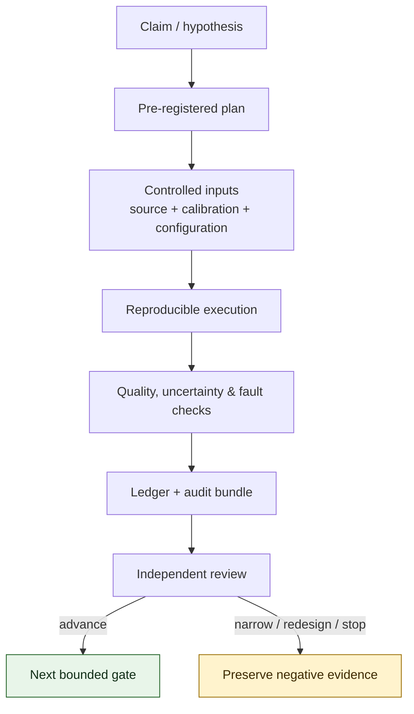
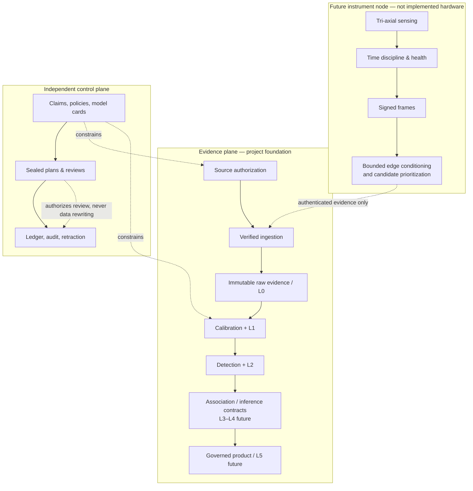
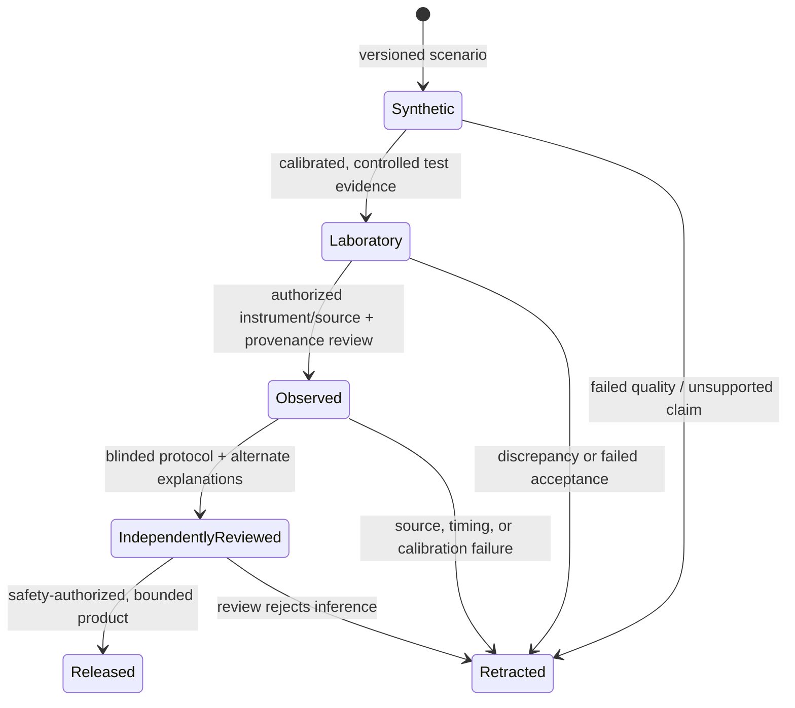
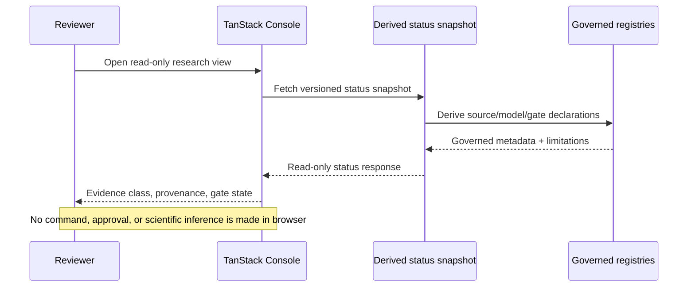
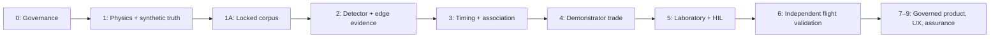

# Project HEIMDALL

> **A falsifiable research platform for testing whether passive electromagnetic sensing can reveal ionospheric plasma-wake signatures associated with small, charged orbital debris.**

HEIMDALL is designed for a difficult scientific question: one where a compelling positive result is possible, but an honest negative result is equally valuable. It provides the evidence, provenance, uncertainty, security, and review infrastructure required to investigate the proposed sensing method without turning simulations, correlations, or an attractive dashboard into an unsupported operational claim.

## Scientific status — read first

This repository is a **research foundation**, not a flight-proven sensor, orbital-debris catalog, collision-prediction system, or spacecraft-command path. It contains a deterministic synthetic reference implementation, governed evidence contracts, and a read-only TanStack research console. It contains **no validated physical wake model, no HEIMDALL hardware measurement, no observed HEIMDALL debris event, no track, and no maneuver authority**.

That boundary is the source of HEIMDALL’s credibility. Every assertion must earn its evidence, preserve its limitations, and survive independent challenge. Nothing in this repository should be represented as a NASA approval, funding decision, prize-level result, or flight capability.

## The scientific proposition

Small orbital debris is difficult to observe and potentially consequential. The HEIMDALL hypothesis is that a charged, hypervelocity object interacting with ionospheric plasma may leave a weak electromagnetic/electrostatic signature that a calibrated, time-disciplined, multi-node passive sensing system could investigate. The hypothesis is high-risk. HEIMDALL therefore optimizes first for **falsifiability, provenance, and uncertainty**, rather than for premature detection claims.

The decisive question is narrow and measurable:

> Under stated environmental, geometry, instrument, timing, and interference assumptions, is a proposed signature distinguishable from plausible backgrounds at a predeclared false-alarm and uncertainty budget?

If the answer is no, the correct result is to narrow, redesign, or stop. If the answer is yes under controlled conditions, HEIMDALL provides the evidence chain required to test that result independently—first in simulation, then laboratory hardware, then authorized flight campaigns.

## Why HEIMDALL is engineered for exceptional scientific review

Ambitious sensing concepts usually fail when evidence becomes untraceable across models, data, instruments, people, and decisions. HEIMDALL treats that failure mode as a first-class engineering problem.

| Scientific integrity | Mission assurance | Architecture | What it prevents |
| --- | --- | --- | --- |
| Synthetic, laboratory, and observed evidence classes | Signed ingestion, replay defense, time-quality and calibration boundaries | Hexagonal ports and typed L0–L5 contracts | Simulations presented as observations |
| Sealed experiments, locked-corpus custody, audit bundles | Durable local records and manifest lineage | Append-only scientific effects and replaceable adapters | Post-hoc tuning and unreproducible results |
| Convergence, benchmark, relation, and comparison controls | Explicit stop rules and no browser command path | TanStack Router, Query, and Table for read-only evidence review | Dashboards hiding uncertainty |
| Independent review, red-team alternatives, null-result publication | Separate control and scientific data planes | Contract tests and repository-independence verification | Capability claims ahead of evidence |

The outcome is not an assurance that the physical effect exists. It is a disciplined system for discovering whether it exists, how confidently it can be measured, and when the evidence says not to proceed.

## What is implemented today

### Reproducible synthetic vertical slice

The reference implementation takes a versioned synthetic scenario through an L0-like waveform, calibration/quality metadata, deterministic matched-filter score, candidate decision, uncertainty/provenance records, stratified evaluation, and a tamper-evident local experiment ledger.

```mermaid
flowchart LR
    S[Versioned synthetic scenario\nassumptions + seed] --> F[Forward-model port\nfixture / illustrative only]
    F --> L0[L0-like waveform\nprovenance + clock + health]
    L0 --> L1[Calibration & quality\nL1 lineage]
    L1 --> D[Transparent detector\nscore + explanation]
    D --> G[Sealed threshold + gates]
    G --> L2[L2 candidate or non-candidate\nuncertainty + reasons]
    L2 --> E[Stratified evaluation]
    E --> A[Append-only ledger\ncontent-addressed audit bundle]
```



Every output declares its evidence class. The supplied vertical slice is synthetic-only and explicitly labels itself **not an observed debris detection**.

### Evidence controls that scale beyond the prototype



Implemented controls include:

- Evidence-class and observed-provenance rules that reject observed records without preserved raw-artifact and manifest lineage.
- Content-addressed ingestion, source registry, custody records, durable local storage, manifest ledger, and portable audit bundles.
- Versioned model cards, controlled admission, typed physical input contracts, conformance checks, sealed benchmarks, numerical convergence, metamorphic/limiting-case checks, and cross-implementation comparison.
- Transparent detector, threshold/gate policy, pre-registered experiments, scenario separation, stratified performance assessment, and uncertainty-budget contracts.
- Signed instrument-frame boundary, schema/media/size validation, anti-replay, time-quality, calibration-certificate, and decoder-lineage controls for future hardware.
- Timing/association/TDOA/covariance/inference-lifecycle contracts; explicit coverage, instrument, transport, edge-resource, and HIL test-plan contracts.
- A TanStack read-only analyst console that presents source, model, and gate status without becoming a system of record or command surface.

Read [the stage delivery ledger](docs/STAGE_DELIVERY_LEDGER.md) for the exact status. A narrow synthetic software milestone is complete; **no primary real-world stage gate is complete**.

## Architecture at a glance



The control plane is intentionally separate from the scientific data plane. No analyst screen, partner feed, or data-processing component can directly control a spacecraft or rewrite historic evidence.

## Evidence maturity: how a claim earns promotion



Moving right is never automatic. Each transition requires a new evidence package, independent review, and a limitation statement. A high score or visually persuasive signal alone is not promotion evidence.

## Technology stack

| Layer | Approach | Reason |
| --- | --- | --- |
| Research domain | Python typed contracts and modular ports | Keeps science rules independent of cloud, UI, radio, and vendor choices |
| Evidence integrity | SHA-256 content addressing, manifest/experiment ledgers, audit bundles | Makes local tampering detectable; does not falsely claim external non-repudiation |
| Model assurance | Model cards, admission, conformance, benchmark, convergence, relation, comparison controls | Separates software correctness from physical validity |
| Future ingestion | Verified-frame, schema/media/time/replay/calibration controls | Fails closed when provenance is incomplete |
| Analyst experience | React, Vite, TanStack Router, Query, Table | Typed navigation, versioned server-state patterns, explicit read-only boundary |
| Security posture | Least privilege, input validation, no client secrets or commands | Keeps authority out of the browser and evidence immutable in effect |

## Demonstration: a convincing and honest walkthrough

The strongest demonstration is not a staged “detection” reveal. It is a repeatable review in which an evaluator can reproduce the result, inspect assumptions, see the non-claim boundary, and observe that the system retains negative outcomes and fails closed.

### Demonstration objective

At the end of the session, a reviewer should be able to say:

1. I know what HEIMDALL is testing and what it is **not** claiming.
2. I reproduced a synthetic L0-to-L2 analysis from a clean checkout.
3. I saw a sealed policy, score, candidate decision, provenance, and audit record rather than an unexplained visualization.
4. I understand the gate that prevents this demonstration from becoming a flight or debris-detection claim.
5. I can see the credible route from today’s prototype to laboratory and independent flight evidence.

### Before the demonstration

1. Use a clean checkout. Do not add confidential inputs, private keys, laboratory data, or claimed observations.
2. Install approved Python and Node dependencies through the organization’s private-registry process.
3. Give the reviewer [the stage ledger](docs/STAGE_DELIVERY_LEDGER.md) and [real-world gate playbook](docs/REAL_WORLD_GATE_ACQUISITION_PLAYBOOK.md) before the session.
4. Invite an independent observer to run the commands below; they should be able to reproduce the work rather than merely watch an operator.

### 45-minute live agenda

| Time | Show | Reviewer takeaway |
| --- | --- | --- |
| 0–5 min | Scientific-status disclosure and hypothesis | Credibility begins by stating what is not proven |
| 5–10 min | Architecture and evidence visuals | Data, control, and claim boundaries are separate |
| 10–18 min | Clean tests and synthetic vertical slice | Core behavior is deterministic and testable |
| 18–28 min | Sealed experiment, ledger, audit bundle | Parameters and results are bound and reviewable |
| 28–35 min | TanStack console | UI shows governed status; it cannot command or create claims |
| 35–42 min | Stage ledger and gate playbook | Funding advances evidence, not marketing claims |
| 42–45 min | Adverse scenarios and questions | Invite disproof, alternatives, and stop criteria |

### Step 1 — verify the clean research baseline

From the `NASA` directory:

```bash
PYTHONPYCACHEPREFIX=/private/tmp/heimdall-pycache PYTHONPATH=src python3 -m compileall -q src scripts tests
PYTHONPATH=src python3 -m unittest discover -s tests -v
PYTHONPATH=src python3 scripts/verify_independence.py
```

Explain the result accurately: these checks verify software contracts and repository independence. They do **not** verify plasma physics, calibrated hardware, or flight performance.

### Step 2 — reproduce the synthetic vertical slice

```bash
PYTHONPATH=src python3 scripts/run_vertical_slice.py
```

Walk the reviewer through the emitted JSON:

- `scientific_status` is the synthetic-only disclosure.
- Candidates contain score, gates, decision reasons, and synthetic scenario identity.
- Metrics are fixture-only and stratified; they are not instrument sensitivity or flight false-alarm evidence.

Ask the reviewer to identify a candidate and a non-candidate. Both are retained with reasons; the system does not erase unfavorable or ambiguous outcomes.

### Step 3 — run a sealed experiment and create an audit bundle

```bash
mkdir -p data/local/runs
PYTHONPATH=src python3 scripts/run_pre_registered_experiment.py \
  --ledger data/local/runs/synthetic-reference-ledger.jsonl \
  --audit-bundle data/local/runs/synthetic-reference-audit.json \
  --generated-at 2026-07-30T00:00:00Z \
  --artifact config/research/claims.json \
  --artifact config/models/model_cards.json

sed -n '1,160p' data/local/runs/synthetic-reference-ledger.jsonl
sed -n '1,220p' data/local/runs/synthetic-reference-audit.json
```

Ask these questions live:

1. Is the threshold/gate policy bound before execution?
2. Does the result point to exact registry and policy digests?
3. Does the audit bundle state the synthetic evidence class and claim boundary?
4. What would change if a configuration, artifact, or ledger record changed?

The answer remains modest: this is local integrity and reproducibility control, not a digital signature, external audit, or scientific validation.

### Step 4 — show model-evidence controls

Open [physics model admission](docs/PHYSICS_MODEL_ADMISSION.md), [numerical convergence](docs/NUMERICAL_CONVERGENCE_CONTRACT.md), [metamorphic relation verification](docs/PHYSICS_RELATION_VERIFICATION.md), and [cross-implementation comparison](docs/INDEPENDENT_MODEL_COMPARISON.md). Explain the sequence: equations/limits first; then conformance, benchmarks, refinement behavior, limiting relations, and separately identified implementation comparison; then independent physical and laboratory review. Do not show a fictional model as a real result.

### Step 5 — demonstrate the TanStack research console

```bash
PYTHONPATH=src python3 scripts/export_research_status.py \
  --generated-at 2026-07-30T00:00:00Z \
  --output apps/analyst-console/public/research-status.json

cd apps/analyst-console
npm run build
npm run dev -- --host 127.0.0.1
```

Open the local Vite address (normally `http://127.0.0.1:5173`) and demonstrate:

1. Research-only status and limitation before any table.
2. Source metadata and why context sources are not debris ground truth.
3. Model validity tiers and gates that remain in progress or blocked.
4. The absence of a command route, secret, privileged calculation, or mutable evidence action.



### Step 6 — close with an evidence investment case

The compelling ask is not “approve an unproven sensor.” It is “fund a transparent, independently challengeable program that can decisively advance, narrow, redesign, or stop a scientifically important hypothesis.” End with the next package:

1. Independent plasma-physics/model review and a model admitted only under published rules.
2. A custodian-separated locked synthetic corpus evaluated once under a sealed detector plan.
3. Evidence-backed detector, timing/association, and demonstrator trades.
4. Laboratory, spectrum, launch, source, and flight authorization only after the measurement chain earns readiness.

## Demonstration safety rules

- Never call the synthetic vertical slice a detection, track, or operational capability demonstration.
- Never use the console to imply live flight data or spacecraft control.
- Never hide an adverse scenario, failed gate, known limitation, or uncertain source.
- Never substitute a checksum for source authenticity, a local hash chain for an external audit, or a benchmark for physical validation.
- Never seek operational maneuver authority from present outputs.

## Roadmap to real-world evidence

The complete acquisition process is in the [real-world gate-acquisition playbook](docs/REAL_WORLD_GATE_ACQUISITION_PLAYBOOK.md).



No amount of software polish substitutes for independent scientific, hardware, regulatory, and flight evidence in the later stages.

## Documentation map

1. [Project documentation index](docs/README.md)
2. [Stage delivery ledger](docs/STAGE_DELIVERY_LEDGER.md)
3. [Real-world gate-acquisition playbook](docs/REAL_WORLD_GATE_ACQUISITION_PLAYBOOK.md)
4. [Falsifiable research-protocol manuscript draft](docs/HEIMDALL_FALSIFIABLE_RESEARCH_PROTOCOL.md)
5. [Implementation architecture and Phase I plan](docs/HEIMDALL_IMPLEMENTATION_PLAN.md)
6. [Detailed execution and evidence flow](docs/HEIMDALL_EXECUTION_FLOW.md)
7. [TanStack analyst-console boundary](docs/TANSTACK_ANALYST_CONSOLE.md)

## The standard of excellence

The highest standard for HEIMDALL is not an extravagant label. It is a result that a skeptical scientist, systems engineer, safety authority, and reviewer can independently reproduce, challenge, bound, and—if warranted—trust. This repository is engineered to make that standard achievable.
