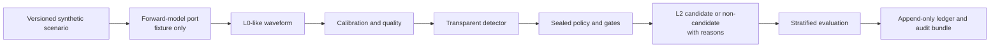
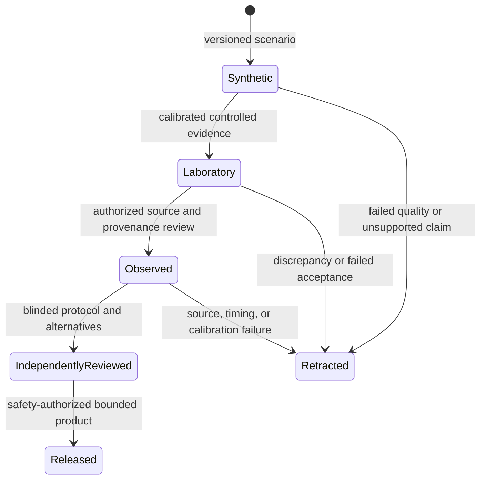

# Project HEIMDALL ELECTRA

Project credit and stewardship: Aarti S Ravikumar (GitHub: @aartisr).

> A reproducible research foundation for testing a high-risk hypothesis: whether passive electromagnetic sensing could reveal ionospheric plasma-wake signatures associated with small, charged orbital debris.

## Status — read this first

HEIMDALL ELECTRA is **research software**, not a flight-proven sensor or an operational space-safety system. The repository contains deterministic synthetic fixtures, governed evidence contracts, and a read-only research-status console. It contains **no validated physical wake model, HEIMDALL ELECTRA hardware measurement, observed HEIMDALL ELECTRA debris event, track, collision prediction, or maneuver authority**.

The project must not be described as NASA-approved, funded, flight-capable, or as having detected orbital debris. A successful software test or a synthetic candidate is not physical validation. An honest negative result is a valid and valuable outcome.

## What is here

- A deterministic synthetic L0-to-L2 reference slice: versioned scenario, L0-like waveform, calibration and quality metadata, transparent detection score, sealed gates, candidate decision, uncertainty/provenance records, stratified evaluation, and local ledger/audit output.
- Evidence controls: source and model registries, content-addressed ingestion, raw-artifact/manifest lineage, custody declarations, append-only local ledgers, and portable audit bundles.
- Scientific and numerical controls: model cards and admission rules, typed physical-input contracts, conformance checks, sealed benchmarks, numerical-convergence checks, relation checks, and independent-model comparison contracts.
- Future instrument boundaries: signed-frame validation, replay defense, schema/media/size controls, timing quality and calibration contracts, association/TDOA/covariance, transport, resource, and HIL test-plan contracts.
- A React/Vite/TanStack analyst console that is read-only by design and clearly displays source limits, claims, and stage gates.

The exact evidence status is maintained in the [stage delivery ledger](docs/STAGE_DELIVERY_LEDGER.md). At this revision, the synthetic software milestone is complete; no primary real-world stage gate is complete.

## Architecture



The scientific data plane and control plane are intentionally separate. Browser code cannot command hardware, create claims, alter governed evidence, or rewrite the ledger.

## Requirements

- Python 3.11 or later (the supported version declared in `pyproject.toml`)
- Node.js with npm, for the optional analyst console

The Python package has no third-party runtime dependencies. The console has a committed `package-lock.json` for reproducible npm installation.

## Quick start

From the repository root:

```bash
PYTHONPYCACHEPREFIX=/private/tmp/heimdall-pycache PYTHONPATH=src python3.11 -m compileall -q src scripts tests
PYTHONPATH=src python3.11 -m unittest discover -s tests -v
PYTHONPATH=src python3.11 scripts/verify_independence.py
PYTHONPATH=src python3.11 scripts/run_vertical_slice.py
```

These commands verify software contracts and reproduce synthetic output. They do **not** verify plasma physics, calibrated hardware, source authenticity beyond each configured contract, or flight performance.

To create a deterministic local experiment record (the fixed timestamp makes this run reproducible):

```bash
mkdir -p data/local/runs
PYTHONPATH=src python3.11 scripts/run_pre_registered_experiment.py \
  --ledger data/local/runs/synthetic-reference-ledger.jsonl \
  --audit-bundle data/local/runs/synthetic-reference-audit.json \
  --generated-at 2026-07-30T00:00:00Z \
  --artifact config/research/claims.json \
  --artifact config/models/model_cards.json
```

The resulting ledger and audit bundle provide local integrity and reproducibility evidence. They are not digital signatures, an external audit, or scientific validation.

## Analyst console

Regenerate its public, derived snapshot and start the local development server:

```bash
PYTHONPATH=src python3.11 scripts/export_research_status.py \
  --generated-at 2026-07-30T00:00:00Z \
  --output apps/analyst-console/public/research-status.json

cd apps/analyst-console
npm ci
npm run build
npm run dev -- --host 127.0.0.1
```

The console normally serves at `http://127.0.0.1:5173`. It validates its status snapshot at runtime, has an accessible retry state, supports keyboard navigation, and changes its evidence table into readable cards on narrow screens. It remains a convenience view—not the system of record.

## Reuse and configuration

The domain code uses modular ports so storage, ingestion, models, and external context can be replaced without rewriting the scientific contracts. Governed project data belongs in `config/`; implementation code belongs in `src/heimdall/`.

The console can be reused for another governed research program:

1. Copy `apps/analyst-console`.
2. Update its presentation boundary in `src/site-config.ts` and ensure the factual metadata in `index.html` matches the new project.
3. Generate `public/research-status.json` from that project's authoritative registries.
4. Run `npm run build` before deployment.

Do not copy HEIMDALL ELECTRA's scientific descriptions, status language, or evidence claims into another project.

## Public deployment and discoverability

The console includes factual page metadata, Open Graph data, WebApplication JSON-LD, a web manifest, `robots.txt`, semantic HTML, and a non-JavaScript status fallback. These make a public deployment more understandable to people and crawlers.

Before publishing, set the canonical URL and sitemap at the final domain/hosting layer. Do not publish restricted research material under the included indexable `robots.txt` policy; change the policy first. Technical SEO, GEO, and accessible design improve discoverability but cannot guarantee rankings, virality, inclusion in every search engine or AI answer, or scientific credibility. Those require stable public URLs, factual primary content, citations, and independently reviewable evidence.

## Evidence promotion rules



A result advances only through new evidence, independent review, and an explicit limitation statement. A score, visualization, or benchmark alone never promotes a claim.

## Documentation

- [Documentation index](docs/README.md)
- [Stage delivery ledger](docs/STAGE_DELIVERY_LEDGER.md)
- [Real-world gate-acquisition playbook](docs/REAL_WORLD_GATE_ACQUISITION_PLAYBOOK.md)
- [Falsifiable research protocol](docs/HEIMDALL_FALSIFIABLE_RESEARCH_PROTOCOL.md)
- [Execution and evidence flow](docs/HEIMDALL_EXECUTION_FLOW.md)
- [Analyst-console boundary and deployment notes](docs/TANSTACK_ANALYST_CONSOLE.md)

## Standard of evidence

HEIMDALL ELECTRA aims to make each result reproducible, challengeable, bounded, and—only when warranted—trustworthy. It does not promise that the proposed physical effect exists.
