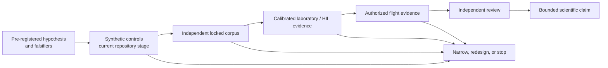
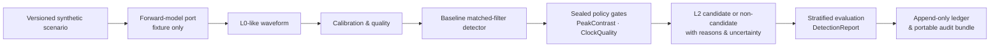
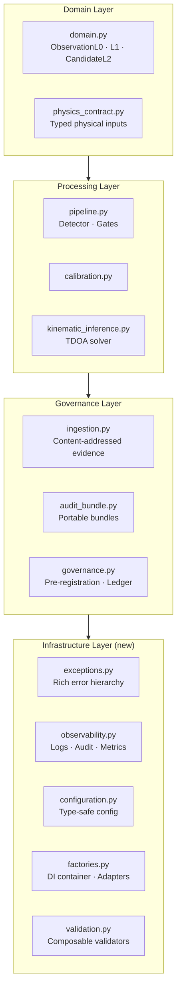
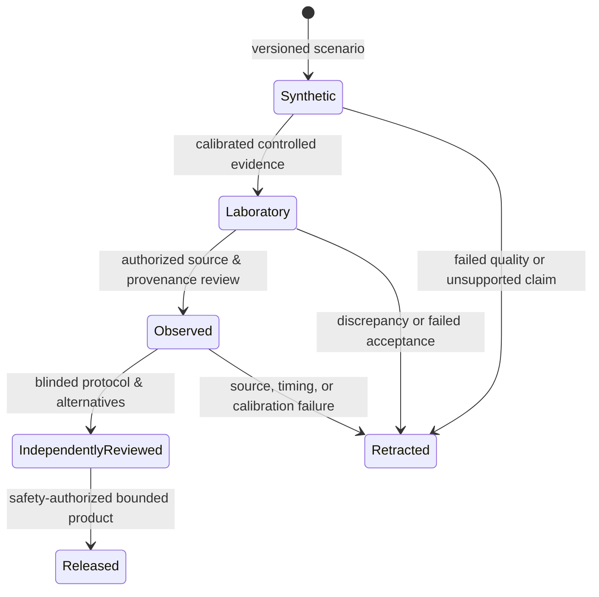

# Project HEIMDALL ELECTRA

**Stewardship:** Aarti S Ravikumar — [@aartisr](https://github.com/aartisr)

> A reproducible research platform built to ask one difficult question honestly: can passive electromagnetic sensing detect an ionospheric plasma-wake signature associated with small, charged orbital debris? The repository does not assume that the effect exists. It supplies the contracts, synthetic reference path, tests, and evidence controls required to find out.

📖 **Scientific Monograph:** For mathematical physics derivations (ion-acoustic kinetic shock, plasma-induced RCS modifications, non-linear hyperbola TDOA solvers, 2D Gaussian $P_c$ conjunction probability, and SHA-256 audit chain formulas), see **[Scientific Evaluation & Theoretical Foundations](docs/NOBEL_GRADE_SCIENTIFIC_EVALUATION.md)**.  
🚀 **NASA Executive Briefing:** For mission architecture, TRL 3 → 5 maturation roadmap, and NASA ODPO/CARA alignment, see **[NASA Executive Technical Memorandum](docs/NASA_EXECUTIVE_BRIEFING_TRL_ROADMAP.md)**.

Space is not empty; it is an environment of motion, plasma, radio energy, and uncertainty. Small debris is particularly hard to characterize. HEIMDALL ELECTRA begins before any promise of a new sensor or a safer orbit: with a falsifiable hypothesis, a precise record of what the software did, and a refusal to let a plausible simulation become a physical claim.

---

## Table of Contents

- [Project HEIMDALL ELECTRA](#project-heimdall-electra)
  - [Table of Contents](#table-of-contents)
  - [What Is This?](#what-is-this)
  - [Status — Read First](#status--read-first)
  - [What Exists Today—and What It Means](#what-exists-todayand-what-it-means)
  - [The Road from an Idea to Evidence](#the-road-from-an-idea-to-evidence)
  - [The Question the Software Is Built to Test](#the-question-the-software-is-built-to-test)
  - [How the Repository Keeps the Question Intact](#how-the-repository-keeps-the-question-intact)
  - [Repository Layout](#repository-layout)
  - [Requirements \& Installation](#requirements--installation)
    - [System prerequisites](#system-prerequisites)
    - [Clone and verify](#clone-and-verify)
  - [Five Minutes to a Reproducible Question](#five-minutes-to-a-reproducible-question)
  - [Running the Full Test Suite](#running-the-full-test-suite)
    - [Test module reference](#test-module-reference)
  - [Follow One Synthetic Observation from Waveform to Record](#follow-one-synthetic-observation-from-waveform-to-record)
  - [Pre-register Before You Look](#pre-register-before-you-look)
  - [Give Every Artifact a Chain of Custody](#give-every-artifact-a-chain-of-custody)
  - [Add Context Without Mistaking It for a Detection](#add-context-without-mistaking-it-for-a-detection)
  - [Explore Freely, Then Keep Exploration Separate](#explore-freely-then-keep-exploration-separate)
  - [See the Boundaries in a Browser](#see-the-boundaries-in-a-browser)
    - [Step 1 — Generate the data snapshot](#step-1--generate-the-data-snapshot)
    - [Step 2 — Install Node dependencies (first time only)](#step-2--install-node-dependencies-first-time-only)
    - [Step 3 — Build](#step-3--build)
    - [Step 4 — Run the development server](#step-4--run-the-development-server)
    - [What the console shows](#what-the-console-shows)
  - [Build on the Same Guardrails](#build-on-the-same-guardrails)
    - [Exception Handling](#exception-handling)
    - [Structured Logging with Audit Trail](#structured-logging-with-audit-trail)
    - [Type-Safe Configuration](#type-safe-configuration)
    - [Dependency Injection \& Pluggable Adapters](#dependency-injection--pluggable-adapters)
    - [Composable Validators](#composable-validators)
  - [Let Evidence, Not Enthusiasm, Advance a Claim](#let-evidence-not-enthusiasm-advance-a-claim)
  - [Extend the System Without Loosening Its Claims](#extend-the-system-without-loosening-its-claims)
    - [Add a new detector](#add-a-new-detector)
    - [Add a new gate](#add-a-new-gate)
    - [Add a pluggable storage adapter](#add-a-pluggable-storage-adapter)
  - [When the Work Does Not Run Yet](#when-the-work-does-not-run-yet)
    - [`ModuleNotFoundError: No module named 'heimdall'`](#modulenotfounderror-no-module-named-heimdall)
    - [`python3.11: command not found`](#python311-command-not-found)
    - [Tests fail with `ImportError` on a new module](#tests-fail-with-importerror-on-a-new-module)
    - [Analyst console: blank page or JSON error](#analyst-console-blank-page-or-json-error)
    - [`npm ci` fails](#npm-ci-fails)
    - [Audit bundle hash mismatch](#audit-bundle-hash-mismatch)
  - [The Documentary Record](#the-documentary-record)
  - [The Standard of Evidence](#the-standard-of-evidence)

---

## What Is This?

HEIMDALL ELECTRA is a Python reference implementation for the signal-processing and evidence-governance workflow described by this project’s Phase I research plan for passive ionospheric debris detection. It is deliberately useful before it is persuasive: a way to run and inspect a bounded synthetic experiment, not a declaration that nature has yielded the proposed signal.

The [documentation record](docs/README.md) is part of the work, not an appendix. It records the research protocol, source and model boundaries, validation contracts, operations proposals, and the current delivery ledger. Where a planning or design document conflicts with the current state, the [Stage Delivery Ledger](docs/STAGE_DELIVERY_LEDGER.md), [claim registry](config/research/claims.json), and governed configuration take precedence.

| What it **is** | What it is **not** |
|---|---|
| A reproducible synthetic L0→L2 reference pipeline | A flight-proven or operational sensor system |
| A governed evidence framework with audit trails | NASA-approved, funded, or flight-authorized |
| A testable physics-contract and calibration suite | A collision-prediction or maneuver system |
| A read-only research-status analyst console | A replacement for validated physical hardware |
| An extensible research platform with pluggable adapters | A claim that the proposed plasma-wake effect exists |

An honest negative result is as valuable as a positive one. Every synthetic score, benchmark, and visualization is bounded and labeled accordingly.

---

## Status — Read First

The repository contains deterministic synthetic fixtures, governed evidence contracts, content-addressed artifacts, append-only local ledgers, and portable audit bundles. Those are tools for reproducibility; they are not an immutable archive, a digital signature, or independent scientific review. It contains **no validated physical wake model, observed debris event, track, collision prediction, or maneuver authority**.

The narrow internal `synthetic-vertical-slice` software milestone is complete. **No primary-stage exit gate is complete.** The [Stage Delivery Ledger](docs/STAGE_DELIVERY_LEDGER.md) is the authoritative account of what has been implemented, what remains open, and why the distinction matters.

---

## What Exists Today—and What It Means

The project’s present achievement is not a claimed observation. It is a disciplined research foundation that makes future work inspectable and falsifiable.

| Foundation now in the repository | Why it matters | Boundary that remains |
|---|---|---|
| Versioned synthetic scenarios, an illustrative burst-sine fixture, and a null-signal control | The pipeline can be replayed against both a declared synthetic signal and a no-signal control. | Neither registered model represents a plasma wake or supports a physical claim. See [forward-model governance](docs/FORWARD_MODEL_GOVERNANCE.md) and the [model-card registry](docs/MODEL_CARD_REGISTRY.md). |
| Typed physics, calibration, uncertainty, timing, association, TDOA, coverage, instrument, transport, and HIL contracts | Units, frames, time scales, assumptions, uncertainty, and future admission requirements are made explicit before a solver or instrument is trusted. | A contract is not a solver, a measurement, a hardware design, a localization, or a performance result. |
| A transparent matched-filter baseline with separately recorded gates | A raw score, threshold, gate result, and reason can be examined rather than hidden inside an opaque decision. | The current `PeakContrastGate` threshold is a synthetic-fixture interface demonstration, not a calibrated plasma, laboratory, or flight threshold. |
| Content-addressed ingestion, hash-chained local ledgers, and portable audit bundles | Inputs, plans, results, and local artifacts can be bound for reproducible review; post-export modifications can be detected. | Local controls are tamper-evident and process-safe, not externally signed, immutable, independently administered custody. |
| A read-only TanStack research-status console | The project’s limits, source status, and gate state can be made visible without placing authority in the browser. | It is a derived, non-authoritative view; it cannot ingest, approve, suppress, release, or command anything. |

The design does not treat those limits as apologies. They are the experimental apparatus. A future claim is only as credible as its ability to preserve raw evidence, declare its assumptions, quantify uncertainty, withstand alternate explanations, and leave a record when it fails.

---

## The Road from an Idea to Evidence

The [falsifiable research protocol](docs/HEIMDALL_FALSIFIABLE_RESEARCH_PROTOCOL.md) defines a progression designed to prevent a software demonstration from being mistaken for discovery:



At every transition, the work must show more than a favorable score: a sealed plan; stated strata and denominators; complete provenance; a documented uncertainty method; tested alternative explanations; and the independent review appropriate to the gate. A negative, ambiguous, or disconfirming result remains evidence. It is not discarded as an inconvenience.

The immediate scientific gaps are precise: no physics-capable forward model has been admitted; the repository’s synthetic fixtures are not a fresh independently held locked corpus; no laboratory calibration certificate, hardware result, observed HEIMDALL ELECTRA source, multi-node localization solver, or flight evidence is present. The relevant contracts explain what each gap requires to close, including [physics admission](docs/PHYSICS_MODEL_ADMISSION.md), [locked-corpus custody](docs/LOCKED_CORPUS_CUSTODY.md), [calibration certificates](docs/CALIBRATION_CERTIFICATES.md), [signed-frame ingestion](docs/SIGNED_INSTRUMENT_INGESTION.md), and [TDOA inference](docs/TDOA_INFERENCE_CONTRACT.md).

---

## The Question the Software Is Built to Test

The hypothesis is narrow and high-risk: under specified plasma, trajectory, instrument, timing, and interference conditions, a charged orbital-debris fragment moving through ionospheric plasma may leave a transient electromagnetic or electrostatic disturbance that a ground-based HF/VHF receiver array could distinguish from plausible background processes. The diagram below is a proposed measurement chain, not an observed mechanism or a validated instrument design.

```
Debris object (charged)
  │
  └─► Ionospheric plasma wake (transient, EM perturbation)
          │
          └─► Ground-based passive HF/VHF receiver array
                  │
                  └─► TDOA-based position / velocity inference
                              │
                              └─► Candidate L2 event record
```

The software expresses the proposed chain as three reviewable data levels:
- **L0** — Raw timestamped waveform samples from each receiver node
- **L1** — Calibrated, quality-checked observation with provenance metadata
- **L2** — Candidate detection with score, gate decisions, uncertainty, and full audit trail

---

## How the Repository Keeps the Question Intact





The scientific data plane and the control plane are intentionally separate. Browser code cannot command hardware, create claims, alter governed evidence, or rewrite the ledger. This boundary is practical as much as philosophical: a dashboard must never acquire authority merely by displaying a result.

---

## Repository Layout

```
heimdall-electra/
│
├── src/heimdall/               # All Python source — one importable package
│   ├── domain.py               # Immutable contracts: ObservationL0, L1, CandidateL2
│   ├── pipeline.py             # Detector + gates (BaselineMatchedFilter, PeakContrastGate …)
│   ├── simulation.py           # Synthetic scenario + waveform generator
│   ├── calibration.py          # L0→L1 calibration
│   ├── governance.py           # Pre-registered experiments, ledger
│   ├── ingestion.py            # Content-addressed artifact ingestion
│   ├── audit_bundle.py         # Portable audit bundles
│   ├── evaluation.py           # Stratified evaluation & DetectionReport
│   ├── kinematic_inference.py  # TDOA / position-velocity solver contract
│   ├── physics_contract.py     # Typed physical-input contracts
│   │
│   ├── exceptions.py           # ★ Rich exception hierarchy
│   ├── observability.py        # ★ Structured logging, audit trails, metrics
│   ├── configuration.py        # ★ Type-safe configuration management
│   ├── factories.py            # ★ DI container, adapters, lifecycle
│   ├── validation.py           # ★ Composable validators & verification chains
│   │
│   └── … (40+ additional modules for physics, timing, HIL, etc.)
│
├── tests/                      # 40+ unittest modules — run with `python -m unittest`
│
├── scripts/
│   ├── run_vertical_slice.py           # End-to-end synthetic pipeline run
│   ├── run_pre_registered_experiment.py # Locked-protocol experiment with ledger
│   ├── run_development_sweep.py        # Multi-parameter development sweep
│   ├── export_research_status.py       # Generate analyst-console JSON snapshot
│   ├── ingest_artifact.py              # Ingest a signed artifact into evidence store
│   ├── ingest_noaa_context.py          # Pull NOAA SWPC context
│   ├── parse_noaa_context.py           # Parse cached NOAA data
│   └── verify_independence.py          # Assert no cross-contamination
│
├── config/
│   ├── models/                 # Model cards and registry
│   ├── research/               # Claims, gates, thresholds
│   └── sources/                # Source registry
│
├── apps/analyst-console/       # React/Vite/TanStack read-only research console
│
└── docs/                       # 30+ governance and protocol documents
```

★ = infrastructure modules included in this release.

---

## Requirements & Installation

### System prerequisites

| Requirement | Minimum | Notes |
|---|---|---|
| Python | 3.11 | No third-party runtime deps |
| Node.js + npm | 18 LTS | Only for analyst console |
| Git | Any recent | Standard clone |
| Disk space | ~50 MB | Excludes `node_modules` |

### Clone and verify

```bash
# 1. Clone
git clone https://github.com/aartisr/heimdall-electra.git
cd heimdall-electra

# 2. Verify Python version
python3.11 --version      # must be 3.11.x or later

# 3. Compile all source to catch syntax errors immediately
PYTHONPYCACHEPREFIX=/tmp/heimdall-pycache \
PYTHONPATH=src \
python3.11 -m compileall -q src scripts tests

# If you see no output, everything compiled cleanly.
```

> **No virtual environment required** — the package has zero third-party runtime dependencies. A venv is still recommended for isolation:
>
> ```bash
> python3.11 -m venv .venv
> source .venv/bin/activate   # Windows: .venv\Scripts\activate
> pip install -e .
> ```

---

## Five Minutes to a Reproducible Question

Run these four commands from the repository root. They compile the source, exercise the test suite, verify project-independence controls, and execute the deterministic synthetic vertical slice. They establish that the local software installation works; they do not validate the hypothesis or a physical sensor.

```bash
# Step 1 — Compile (catches syntax errors)
PYTHONPATH=src python3.11 -m compileall -q src scripts tests

# Step 2 — Run the full test suite (49 test modules at the time of writing)
PYTHONPATH=src python3.11 -m unittest discover -s tests -v 2>&1 | tail -5

# Step 3 — Verify cross-contamination independence
PYTHONPATH=src python3.11 scripts/verify_independence.py

# Step 4 — Run the end-to-end synthetic pipeline
PYTHONPATH=src python3.11 scripts/run_vertical_slice.py
```

**Expected output from Step 4:**
```
[vertical_slice] scenario  : synthetic-reference-v1
[vertical_slice] detect    : score=0.xx  detected=True/False
[vertical_slice] gate      : PeakContrast PASS/FAIL  ClockQuality PASS/FAIL
[vertical_slice] candidate : CandidateL2(id=..., detected=...)
[vertical_slice] evaluation: DetectionReport(...)
[vertical_slice] audit     : bundle written → data/local/...
```

If all four steps complete cleanly, you have a working local installation and a replayable synthetic reference run.

---

## Running the Full Test Suite

```bash
# All tests, verbose
PYTHONPATH=src python3.11 -m unittest discover -s tests -v

# Single test module
PYTHONPATH=src python3.11 -m unittest tests.test_vertical_slice -v

# Specific test case
PYTHONPATH=src python3.11 -m unittest tests.test_governance.TestPreRegisteredExperiment -v

# Run tests matching a pattern
PYTHONPATH=src python3.11 -m unittest discover -s tests -p "test_physics*.py" -v

# Fail fast on first error
PYTHONPATH=src python3.11 -m unittest discover -s tests -f
```

### Test module reference

| Test module | What it covers |
|---|---|
| `test_vertical_slice.py` | Full L0→L2 pipeline, synthetic reference |
| `test_governance.py` | Pre-registration, ledger, experiment plans |
| `test_ingestion.py` | Content-addressed artifact ingestion |
| `test_audit_bundle.py` | Bundle creation, serialization, verification |
| `test_calibration_registry.py` | Calibration contracts and certificates |
| `test_physics_contract.py` | Typed physical inputs validation |
| `test_physics_benchmarks.py` | Sealed benchmark conformance |
| `test_physics_relations.py` | Physical relation checks |
| `test_kinematic_inference.py` | TDOA / position-velocity solver |
| `test_timing_calibration.py` | Clock quality and timing contracts |
| `test_covariance.py` | Uncertainty and covariance contracts |
| `test_association.py` | Multi-node event association |
| `test_model_registry.py` | Model card registry |
| `test_model_admission.py` | Model admission rules |
| `test_model_comparison.py` | Independent model comparison contracts |
| `test_corpus_custody.py` | Locked corpus chain-of-custody |
| `test_claims.py` | Claim governance |
| `test_context.py` | External context ingestion |
| `test_alignment.py` | Context alignment |
| `test_frame_validation.py` | Signed-frame validation |
| `test_replay_protection.py` | Replay defense |
| `test_durable_storage.py` | Durable local storage |
| `test_edge_benchmark.py` | Edge resource benchmarks |
| `test_independence.py` | Source independence checks |
| `test_uncertainty.py` | Uncertainty budget |
| `test_coverage_trade.py` | Coverage trade studies |
| `test_transport_budget.py` | Transport budget contracts |
| `test_instrument_budget.py` | Instrument budget contracts |
| `test_hil_validation.py` | HIL test-plan contracts |
| … | 40+ modules total |

---

## Follow One Synthetic Observation from Waveform to Record

The vertical slice carries a deterministic synthetic observation from L0-like waveform to candidate assessment and an audit bundle in one run. It is the repository’s primary daily sanity check—not an end-to-end demonstration of field detection.

```bash
PYTHONPATH=src python3.11 scripts/run_vertical_slice.py
```

This is the primary daily sanity check. It exercises every layer:
`SyntheticScenario → generate_observation → calibrate → detect → gates → CandidateL2 → evaluate → ledger → audit_bundle`

To inspect the pipeline programmatically:

```python
# scripts/my_experiment.py
import sys; sys.path.insert(0, "src")
from heimdall import (
    SyntheticScenario, generate_observation,
    calibrate, detect, BaselineMatchedFilter,
    PeakContrastGate, ClockQualityGate,
    evaluate, build_audit_bundle,
)

scenario = SyntheticScenario.reference()
obs_l0 = generate_observation(scenario)
obs_l1 = calibrate(obs_l0)

detector = BaselineMatchedFilter()
gates    = [PeakContrastGate(), ClockQualityGate()]
candidate = detect(obs_l1, detector, gates)

report = evaluate([candidate], scenario)
bundle = build_audit_bundle(scenario, [candidate], report)
print(f"detected={candidate.detected}  score={candidate.score:.4f}")
print(f"bundle_id={bundle.bundle_id}")
```

```bash
PYTHONPATH=src python3.11 scripts/my_experiment.py
```

---

## Pre-register Before You Look

Pre-registered experiments lock the hypothesis, metrics, and analysis plan **before** evaluation. Their outputs are written to an append-only local ledger and a portable audit bundle, so a later reader can see what was planned, what artifacts were used, and what was produced.

```bash
mkdir -p data/local/runs

PYTHONPATH=src python3.11 scripts/run_pre_registered_experiment.py \
  --ledger      data/local/runs/synthetic-reference-ledger.jsonl \
  --audit-bundle data/local/runs/synthetic-reference-audit.json \
  --generated-at 2026-07-30T00:00:00Z \
  --artifact    config/research/claims.json \
  --artifact    config/models/model_cards.json
```

| Flag | Purpose |
|---|---|
| `--ledger` | Path for the append-only JSONL ledger (created if absent) |
| `--audit-bundle` | Path for the portable JSON audit bundle |
| `--generated-at` | Fixed ISO-8601 timestamp — makes the run fully reproducible |
| `--artifact` | One or more config artifacts to seal into the bundle (repeatable) |

The resulting files contain:
- A sealed hash of every input artifact
- The full `ExperimentPlan` and `ExperimentResult`
- A `DetectionReport` with stratified statistics
- Chain-of-custody metadata

> **Reproducibility boundary:** for this deterministic synthetic workflow, fixing `--generated-at` produces byte-identical ledger and bundle entries in the supported environment. This statement does not apply to network-fetched data, external artifacts, or future non-deterministic components.

---

## Give Every Artifact a Chain of Custody

An external artifact—such as a calibration file, raw waveform, or source document—can be placed in the content-addressed evidence store with an explicit evidence class:

```bash
PYTHONPATH=src python3.11 scripts/ingest_artifact.py \
  --artifact path/to/my_calibration.json \
  --evidence-class laboratory \
  --store-root data/local/evidence
```

This computes a SHA-256 content address, writes the artifact to the configured local store, and appends a custody record to the manifest ledger. It detects later content changes, but it does not by itself prove origin, authorization, calibration, or scientific validity. The `--evidence-class` must be one of:

| Class | Meaning |
|---|---|
| `synthetic` | Deterministic fixture — no physical measurement |
| `laboratory` | Calibrated controlled measurement |
| `observed` | Authorized field / space observation |
| `external_context` | Supporting context (e.g., NOAA indices) |

Retrieve an ingested artifact by its content address:

```python
from heimdall.ingestion import FileEvidenceStore
from pathlib import Path

store = FileEvidenceStore(Path("data/local/evidence"))
payload = store.get("sha256:<hex-digest>")
```

---

## Add Context Without Mistaking It for a Detection

External ionospheric context—such as planetary K-index and solar-flux data—can be fetched from NOAA SWPC and ingested as `external_context` evidence. Context can inform later analysis; it is never observed debris evidence.

```bash
# Fetch and ingest in one step
PYTHONPATH=src python3.11 scripts/ingest_noaa_context.py \
  --store-root data/local/evidence \
  --ledger     data/local/runs/context-ledger.jsonl

# Or parse a previously downloaded NOAA file
PYTHONPATH=src python3.11 scripts/parse_noaa_context.py \
  --input  data/external/noaa_kp.json \
  --output data/local/noaa_kp_parsed.json
```

> **Network note:** `ingest_noaa_context.py` contacts `https://services.swpc.noaa.gov`. Run this only when an internet connection is available and the NOAA endpoint is reachable. Offline development uses the cached files in `data/external/`.

---

## Explore Freely, Then Keep Exploration Separate

Development sweeps explore detector sensitivity across a configurable range without altering a locked pre-registered protocol.

```bash
PYTHONPATH=src python3.11 scripts/run_development_sweep.py
```

Sweeps output a summary table to stdout and can write per-run records for analysis. They are explicitly **not** pre-registered and must not be used to confirm or deny hypotheses.

---

## See the Boundaries in a Browser

The read-only browser console offers a visual overview of current evidence status, stage gates, claims, and source limits. It is designed to make the limits legible, not to make them disappear.

### Step 1 — Generate the data snapshot

```bash
PYTHONPATH=src python3.11 scripts/export_research_status.py \
  --generated-at 2026-07-30T00:00:00Z \
  --output apps/analyst-console/public/research-status.json
```

### Step 2 — Install Node dependencies (first time only)

```bash
cd apps/analyst-console
npm ci
```

### Step 3 — Build

```bash
npm run build
```

### Step 4 — Run the development server

```bash
npm run dev -- --host 127.0.0.1
```

Open **http://127.0.0.1:5173** in your browser.

### What the console shows

| Panel | Content |
|---|---|
| Research status | Current stage gate progress |
| Evidence classes | Synthetic / Laboratory / Observed / External |
| Claims | Bounded claims with explicit limitations |
| Source limits | What each source can and cannot assert |
| Stage gates | Each gate's open/closed/pending status |

The console validates its JSON snapshot at runtime, supports keyboard navigation, degrades gracefully without JavaScript, and adapts to narrow screens. It is a **convenience view only** — not the system of record.

---

## Build on the Same Guardrails

Five infrastructure modules are importable directly from the `heimdall` package. Together they provide clearer failures, structured operations, validated configuration, adapter composition, and accumulated validation feedback.

### Exception Handling

```python
from heimdall import (
    create_detection_error, DetectionError,
    ErrorSeverity, ErrorDomain,
)

try:
    candidate = detect(obs_l1, detector, gates)
except DetectionError as e:
    print(e.context.message)   # Clear description
    print(e.context.hint)      # Actionable recovery suggestion
    print(e.context.severity)  # RECOVERABLE | DEGRADED | FATAL
```

### Structured Logging with Audit Trail

```python
from heimdall import create_logger, CorrelationContext

logger = create_logger("my_component")
CorrelationContext.set_id("run-001")          # Propagates across all log entries

logger.log_operation_start("detect")
# … do work …
logger.log_operation_complete("detect", duration_s=0.042)
# Emits JSON-structured log lines with timestamp, correlation_id, component
```

### Type-Safe Configuration

```python
from heimdall import (
    ConfigurationSchema, ConfigField, ConfigValueType,
    ConfigConstraint, ConfigurationManager,
)
from pathlib import Path

schema = ConfigurationSchema("detector")
schema.add_field(ConfigField(
    name="threshold", value_type=ConfigValueType.FLOAT, required=True,
    constraints=[ConfigConstraint("min", 0.0), ConfigConstraint("max", 1.0)],
))

manager = ConfigurationManager()
config  = manager.load_from_file("detector", Path("config/detector.json"), schema)
threshold = config.get_float("threshold")     # Always a float, always validated
```

### Dependency Injection & Pluggable Adapters

```python
from heimdall import get_container, AdapterRegistry, SingletonFactory
from heimdall import BaselineMatchedFilter

container = get_container()

# Register pluggable detector implementations
registry = AdapterRegistry(object)
registry.register("baseline", BaselineMatchedFilter)
container.register_adapter_registry("detector", registry)

# Resolve anywhere in the codebase
detector = container.get_adapter_registry("detector").create("baseline")
```

### Composable Validators

```python
from heimdall import RangeValidator, PatternValidator, CustomValidator

# Chain validators — all errors collected, not short-circuited
validator = (
    RangeValidator(0.0, 1.0, "score")
    .chain(PatternValidator(r"^obs-\d+$", "observation_id"))
)

report = validator.validate(candidate)
if not report.is_valid():
    for err in report.errors:
        print(f"{err.field}: {err.message}  →  {err.hint}")
```

---

## Let Evidence, Not Enthusiasm, Advance a Claim

A result advances through evidence classes only through new evidence, independent review, and an explicit limitation statement. A score, visualization, benchmark, or polished interface alone never promotes a claim.



---

## Extend the System Without Loosening Its Claims

### Add a new detector

1. Subclass or implement the `CandidateGate` interface in `src/heimdall/pipeline.py`.
2. Register it in the `AdapterRegistry` under a unique key.
3. Add a corresponding test module in `tests/`.
4. Pre-register any hypothesis before evaluating on corpus data.

### Add a new gate

```python
from heimdall.pipeline import CandidateGate, GateDecision
from heimdall.domain import CandidateL2
from dataclasses import dataclass

@dataclass(frozen=True)
class MyNewGate(CandidateGate):
    min_snr: float = 10.0

    def evaluate(self, candidate: CandidateL2) -> GateDecision:
        passed = candidate.score >= self.min_snr
        return GateDecision(gate=type(self).__name__, passed=passed,
                            reason=f"snr={candidate.score:.2f}")
```

### Add a pluggable storage adapter

```python
from heimdall.ingestion import EvidenceStore

class MyCloudStore(EvidenceStore):
    def put(self, payload: bytes) -> str:
        # Upload to cloud, return content address
        ...
    def get(self, address: str) -> bytes:
        ...
```

Register it with the `AdapterRegistry` and the rest of the system picks it up automatically.

---

## When the Work Does Not Run Yet

### `ModuleNotFoundError: No module named 'heimdall'`

```bash
# Always prefix commands with PYTHONPATH=src
PYTHONPATH=src python3.11 scripts/run_vertical_slice.py

# Or install the package in editable mode
pip install -e .
```

### `python3.11: command not found`

```bash
# macOS with Homebrew
brew install python@3.11
export PATH="/opt/homebrew/bin:$PATH"

# macOS system Python check
python3 --version   # if ≥3.11, use python3 instead of python3.11
```

### Tests fail with `ImportError` on a new module

Ensure your new module is included in `src/heimdall/__init__.py` or imported directly. Run `python3.11 -m compileall -q src` first to catch syntax errors.

### Analyst console: blank page or JSON error

```bash
# Regenerate the snapshot first
PYTHONPATH=src python3.11 scripts/export_research_status.py \
  --generated-at 2026-07-30T00:00:00Z \
  --output apps/analyst-console/public/research-status.json

# Rebuild
cd apps/analyst-console && npm run build && npm run dev -- --host 127.0.0.1
```

### `npm ci` fails

```bash
# Ensure Node.js ≥18 is installed
node --version
npm --version

# Clear npm cache and retry
npm cache clean --force && npm ci
```

### Audit bundle hash mismatch

This means an artifact was modified after ingestion. Re-ingest the corrected artifact and note the discrepancy in the experiment ledger.

---

## The Documentary Record

The documents are deliberately more than product documentation: they make the burden of proof inspectable. The [docs index](docs/README.md) is the shortest route through the project. The catalog below links every document currently in `docs/`; descriptions summarize intent, not evidence status. The [Stage Delivery Ledger](docs/STAGE_DELIVERY_LEDGER.md) remains the authority for current gate completion.

### Research charter, status, and evidence pathways

| Document | What it contributes |
|---|---|
| [HEIMDALL_START_HERE.md](docs/HEIMDALL_START_HERE.md) | First vertical slice and the question it must answer |
| [HEIMDALL_FALSIFIABLE_RESEARCH_PROTOCOL.md](docs/HEIMDALL_FALSIFIABLE_RESEARCH_PROTOCOL.md) | Research question, falsifiers, evidence classes, and non-claims |
| [HEIMDALL_IMPLEMENTATION_PLAN.md](docs/HEIMDALL_IMPLEMENTATION_PLAN.md) | Staged Phase I implementation plan |
| [HEIMDALL_EXECUTION_FLOW.md](docs/HEIMDALL_EXECUTION_FLOW.md) | Ordered evidence, safety, provenance, and decision flow |
| [STAGE_DELIVERY_LEDGER.md](docs/STAGE_DELIVERY_LEDGER.md) | Authoritative implemented/open gate status |
| [REAL_WORLD_GATE_ACQUISITION_PLAYBOOK.md](docs/REAL_WORLD_GATE_ACQUISITION_PLAYBOOK.md) | Required packages for future real-world gates |
| [EVIDENCE_PATHWAYS.md](docs/EVIDENCE_PATHWAYS.md) | Proposed routes to real observed evidence |
| [OBSERVED_EVIDENCE_ACQUISITION.md](docs/OBSERVED_EVIDENCE_ACQUISITION.md) | Acquisition guide and pre-analysis controls for future observed evidence |
| [HEIMDALL_DATA_SOURCING_STRATEGY.md](docs/HEIMDALL_DATA_SOURCING_STRATEGY.md) | Source roles, integrity hierarchy, and anti-bias controls |
| [OPERATIONS_GUIDE.md](docs/OPERATIONS_GUIDE.md) | Demonstration and operational workflow guidance |

### Claims, provenance, sources, and reproducibility

| Document | What it contributes |
|---|---|
| [CLAIM_GOVERNANCE.md](docs/CLAIM_GOVERNANCE.md) | Machine-checkable supported, unsupported, and prohibited claims |
| [GATE_REVIEW_GOVERNANCE.md](docs/GATE_REVIEW_GOVERNANCE.md) | Evidence-backed status review requirements |
| [EXPERIMENT_PROTOCOL.md](docs/EXPERIMENT_PROTOCOL.md) | Synthetic experiment rules, strata, confounders, and reports |
| [EXPERIMENT_LEDGER.md](docs/EXPERIMENT_LEDGER.md) | Sealed-plan and hash-chained local-ledger controls |
| [AUDIT_BUNDLES.md](docs/AUDIT_BUNDLES.md) | Portable artifact-bound experiment review bundles |
| [DURABLE_LOCAL_STORAGE.md](docs/DURABLE_LOCAL_STORAGE.md) | Local locking, flush, and atomic-replacement guarantees and limits |
| [DATA_INGESTION_BOUNDARY.md](docs/DATA_INGESTION_BOUNDARY.md) | External-byte admission and local storage boundary |
| [SOURCE_REGISTRY_GOVERNANCE.md](docs/SOURCE_REGISTRY_GOVERNANCE.md) | Approved-source, purpose, and verification boundary |
| [OFFICIAL_CONTEXT_SOURCES.md](docs/OFFICIAL_CONTEXT_SOURCES.md) | Current NOAA context connector and its limits |
| [CONTEXT_DERIVATION.md](docs/CONTEXT_DERIVATION.md) | Bounded derivation of environmental annotations |
| [CONTEXT_ALIGNMENT_GOVERNANCE.md](docs/CONTEXT_ALIGNMENT_GOVERNANCE.md) | Conservative time-alignment rules; current NOAA auto-alignment limit |
| [SIGNED_INSTRUMENT_INGESTION.md](docs/SIGNED_INSTRUMENT_INGESTION.md) | Future fail-closed observed-frame admission contract |
| [PROJECT_INDEPENDENCE.md](docs/PROJECT_INDEPENDENCE.md) | Repository/runtime independence boundary |
| [LOCKED_CORPUS_CUSTODY.md](docs/LOCKED_CORPUS_CUSTODY.md) | One-time independent-corpus requirements and current-fixture limitation |

### Physics, detection, uncertainty, and inference contracts

| Document | What it contributes |
|---|---|
| [FORWARD_MODEL_GOVERNANCE.md](docs/FORWARD_MODEL_GOVERNANCE.md) | Replaceable forward-model boundary and current fixture-only status |
| [MODEL_CARD_REGISTRY.md](docs/MODEL_CARD_REGISTRY.md) | Versioned model identity, tier, assumptions, and excluded claims |
| [PHYSICS_INPUT_CONTRACT.md](docs/PHYSICS_INPUT_CONTRACT.md) | Typed time, frame, unit, plasma, and target input requirements |
| [PHYSICS_MODEL_ADMISSION.md](docs/PHYSICS_MODEL_ADMISSION.md) | Admission boundary for candidate physics models |
| [PHYSICS_MODEL_VALIDATION.md](docs/PHYSICS_MODEL_VALIDATION.md) | Software-conformance checks and what they do not establish |
| [PHYSICS_BENCHMARKS.md](docs/PHYSICS_BENCHMARKS.md) | Sealed benchmark harness for future admitted models |
| [PHYSICS_RELATION_VERIFICATION.md](docs/PHYSICS_RELATION_VERIFICATION.md) | Metamorphic and limiting-case verification contract |
| [NUMERICAL_CONVERGENCE_CONTRACT.md](docs/NUMERICAL_CONVERGENCE_CONTRACT.md) | Sealed refinement-study record for numerical convergence |
| [INDEPENDENT_MODEL_COMPARISON.md](docs/INDEPENDENT_MODEL_COMPARISON.md) | Evidence requirements for cross-implementation comparison |
| [DETECTION_GOVERNANCE.md](docs/DETECTION_GOVERNANCE.md) | Score, threshold, gate, and rejection-reason policy |
| [DETECTOR_PERFORMANCE_ASSESSMENT.md](docs/DETECTOR_PERFORMANCE_ASSESSMENT.md) | Stratified confidence-aware detector assessment |
| [SENSITIVITY_EXPERIMENTS.md](docs/SENSITIVITY_EXPERIMENTS.md) | Development-only sweeps and their reporting boundary |
| [UNCERTAINTY_BUDGET.md](docs/UNCERTAINTY_BUDGET.md) | Explicit uncertainty components and combination limits |
| [CALIBRATION_CERTIFICATES.md](docs/CALIBRATION_CERTIFICATES.md) | Future traceable calibration admission and lifecycle |
| [MULTI_NODE_ASSOCIATION.md](docs/MULTI_NODE_ASSOCIATION.md) | Conservative multi-node association foundation |
| [TDOA_INFERENCE_CONTRACT.md](docs/TDOA_INFERENCE_CONTRACT.md) | Solver-neutral localization, ambiguity, and covariance contract |
| [INFERENCE_LIFECYCLE.md](docs/INFERENCE_LIFECYCLE.md) | Evidence-backed inference, rejection, retraction, and archival lifecycle |

### Future system, interface, and resource boundaries

| Document | What it contributes |
|---|---|
| [COVERAGE_TRADE_CONTRACT.md](docs/COVERAGE_TRADE_CONTRACT.md) | Assumption-bound constellation coverage trades |
| [INSTRUMENT_BUDGET_CONTRACT.md](docs/INSTRUMENT_BUDGET_CONTRACT.md) | Instrument-envelope requirements for future trades |
| [TRANSPORT_BUDGET_CONTRACT.md](docs/TRANSPORT_BUDGET_CONTRACT.md) | Explicit raw/contact/overhead/loss transport accounting |
| [EDGE_RESOURCE_BENCHMARKS.md](docs/EDGE_RESOURCE_BENCHMARKS.md) | Edge latency, memory, power, and throughput evidence requirements |
| [HIL_VALIDATION_CONTRACT.md](docs/HIL_VALIDATION_CONTRACT.md) | Future hardware-in-the-loop plan/result binding |
| [TANSTACK_ANALYST_CONSOLE.md](docs/TANSTACK_ANALYST_CONSOLE.md) | Read-only console architecture, accessibility, and security limits |
| [RESEARCH_STATUS_SNAPSHOT.md](docs/RESEARCH_STATUS_SNAPSHOT.md) | Derived console snapshot and non-authoritative browser boundary |
| [DEBRIS_VISUALIZATION_PLAN.md](docs/DEBRIS_VISUALIZATION_PLAN.md) | Visualization and mission-risk design plan with evidence labels |

### Engineering references and implementation history

| Document | What it contributes |
|---|---|
| [ARCHITECTURE_ENHANCEMENTS.md](docs/ARCHITECTURE_ENHANCEMENTS.md) | Domain/processing/governance/infrastructure patterns and extension points |
| [IMPLEMENTATION_QUALITY_STANDARDS.md](docs/IMPLEMENTATION_QUALITY_STANDARDS.md) | Quality, validation, resilience, security, and maintainability guidance |
| [TESTING_STRATEGY.md](docs/TESTING_STRATEGY.md) | Unit, integration, property, chaos, and benchmark test strategy |
| [DEPLOYMENT_OPERATIONS.md](docs/DEPLOYMENT_OPERATIONS.md) | Proposed deployment, observability, recovery, and release practices |
| [QUICK_REFERENCE.md](docs/QUICK_REFERENCE.md) | API, configuration, logging, validation, and test patterns |
| [COMPREHENSIVE_ENHANCEMENT_AUDIT.md](docs/COMPREHENSIVE_ENHANCEMENT_AUDIT.md) | Enhancement inventory and verification procedures |
| [COMPREHENSIVE_ENHANCEMENT_SUMMARY.md](docs/COMPREHENSIVE_ENHANCEMENT_SUMMARY.md) | Enhancement overview and migration guidance |
| [ENHANCEMENT_MANIFEST.md](docs/ENHANCEMENT_MANIFEST.md) | Historical enhancement manifest and forward-looking plans |
| [docs/README.md](docs/README.md) | Documentation landing page and original proposal link |

---

## The Standard of Evidence

HEIMDALL ELECTRA aims to make every result **reproducible, challengeable, bounded, and—only when warranted—trustworthy**. It does not assert that the proposed physical effect exists. The project’s ambition is not a premature answer; it is a process capable of recognizing one, including an honest negative result.

Every output carries:
- The evidence class that produced it (`synthetic` / `laboratory` / `observed`)
- The gate decisions that accepted or rejected it
- A content-addressed artifact lineage
- An append-only ledger entry
- A portable audit bundle

No result is promoted beyond its evidence class without new independent evidence, a blinded evaluation protocol, and an explicit limitation statement.

---

*Project HEIMDALL ELECTRA — Aarti S Ravikumar · [@aartisr](https://github.com/aartisr)*
