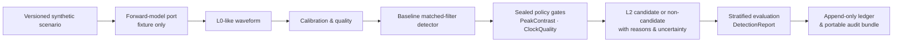
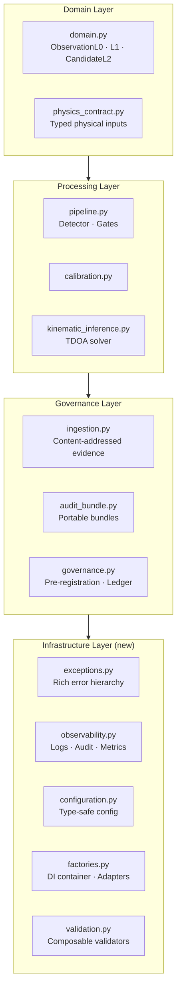
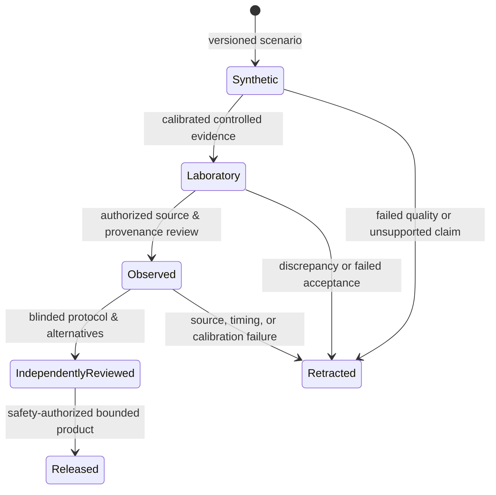

# Project HEIMDALL ELECTRA

**Stewardship:** Aarti S Ravikumar — [@aartisr](https://github.com/aartisr)

> A reproducible research platform for testing a high-risk hypothesis: whether passive electromagnetic sensing can reveal ionospheric plasma-wake signatures associated with small, charged orbital debris — enabling detection of objects currently invisible to radar and optical systems.

---

## Table of Contents

1. [What Is This?](#what-is-this)
2. [Status — Read First](#status--read-first)
3. [The Science](#the-science)
4. [Architecture](#architecture)
5. [Repository Layout](#repository-layout)
6. [Requirements & Installation](#requirements--installation)
7. [Five-Minute Quick Start](#five-minute-quick-start)
8. [Running the Full Test Suite](#running-the-full-test-suite)
9. [Running a Vertical Slice (End-to-End Pipeline)](#running-a-vertical-slice-end-to-end-pipeline)
10. [Pre-registered Experiments](#pre-registered-experiments)
11. [Artifact Ingestion & Evidence Chain](#artifact-ingestion--evidence-chain)
12. [NOAA Context Ingestion](#noaa-context-ingestion)
13. [Development Sweeps](#development-sweeps)
14. [Analyst Console (Web UI)](#analyst-console-web-ui)
15. [Using the Infrastructure Modules](#using-the-infrastructure-modules)
16. [Evidence Promotion Rules](#evidence-promotion-rules)
17. [Extending the System](#extending-the-system)
18. [Troubleshooting](#troubleshooting)
19. [Documentation Index](#documentation-index)
20. [Standard of Evidence](#standard-of-evidence)

---

## What Is This?

HEIMDALL ELECTRA is a **research-grade Python platform** implementing the full signal-processing and governance pipeline proposed in the NASA Innovative Advanced Concepts (NIAC) Phase I study for passive ionospheric debris detection. It is:

| What it **is** | What it is **not** |
|---|---|
| A reproducible synthetic L0→L2 reference pipeline | A flight-proven or operational sensor system |
| A governed evidence framework with audit trails | NASA-approved, funded, or flight-authorized |
| A testable physics-contract and calibration suite | A collision-prediction or maneuver system |
| A read-only research-status analyst console | A replacement for validated physical hardware |
| A plug-and-play, enterprise-grade research platform | A claim that the proposed plasma-wake effect exists |

An honest negative result is as valuable as a positive one. Every synthetic score, benchmark, and visualization is bounded and labeled accordingly.

---

## Status — Read First

The repository contains deterministic synthetic fixtures, governed evidence contracts, and an immutable audit trail. It contains **no validated physical wake model, observed debris event, track, collision prediction, or maneuver authority**.

Current stage: **Synthetic software milestone complete.** No primary real-world gate is closed. See the [Stage Delivery Ledger](docs/STAGE_DELIVERY_LEDGER.md) for the authoritative status of every gate.

---

## The Science

The hypothesis: a charged orbital debris fragment passing through ionospheric plasma leaves a transient wake signature detectable in the HF/VHF electromagnetic spectrum at ground level — passively, without transmitters, using an array of low-cost software-defined receivers synchronized to GPS time.

```
Debris object (charged)
  │
  └─► Ionospheric plasma wake (transient, EM perturbation)
          │
          └─► Ground-based passive HF/VHF receiver array
                  │
                  └─► TDOA-based position / velocity inference
                              │
                              └─► Candidate L2 event record
```

The full physics-to-software chain:
- **L0** — Raw timestamped waveform samples from each receiver node
- **L1** — Calibrated, quality-checked observation with provenance metadata
- **L2** — Candidate detection with score, gate decisions, uncertainty, and full audit trail

---

## Architecture





The scientific data plane and control plane are intentionally separate. Browser code cannot command hardware, create claims, alter governed evidence, or rewrite the ledger.

---

## Repository Layout

```
heimdall-electra/
│
├── src/heimdall/               # All Python source — one importable package
│   ├── domain.py               # Immutable contracts: ObservationL0, L1, CandidateL2
│   ├── pipeline.py             # Detector + gates (BaselineMatchedFilter, PeakContrastGate …)
│   ├── simulation.py           # Synthetic scenario + waveform generator
│   ├── calibration.py          # L0→L1 calibration
│   ├── governance.py           # Pre-registered experiments, ledger
│   ├── ingestion.py            # Content-addressed artifact ingestion
│   ├── audit_bundle.py         # Portable audit bundles
│   ├── evaluation.py           # Stratified evaluation & DetectionReport
│   ├── kinematic_inference.py  # TDOA / position-velocity solver contract
│   ├── physics_contract.py     # Typed physical-input contracts
│   │
│   ├── exceptions.py           # ★ Rich exception hierarchy
│   ├── observability.py        # ★ Structured logging, audit trails, metrics
│   ├── configuration.py        # ★ Type-safe configuration management
│   ├── factories.py            # ★ DI container, adapters, lifecycle
│   ├── validation.py           # ★ Composable validators & verification chains
│   │
│   └── … (40+ additional modules for physics, timing, HIL, etc.)
│
├── tests/                      # 40+ unittest modules — run with `python -m unittest`
│
├── scripts/
│   ├── run_vertical_slice.py           # End-to-end synthetic pipeline run
│   ├── run_pre_registered_experiment.py # Locked-protocol experiment with ledger
│   ├── run_development_sweep.py        # Multi-parameter development sweep
│   ├── export_research_status.py       # Generate analyst-console JSON snapshot
│   ├── ingest_artifact.py              # Ingest a signed artifact into evidence store
│   ├── ingest_noaa_context.py          # Pull NOAA SWPC context
│   ├── parse_noaa_context.py           # Parse cached NOAA data
│   └── verify_independence.py          # Assert no cross-contamination
│
├── config/
│   ├── models/                 # Model cards and registry
│   ├── research/               # Claims, gates, thresholds
│   └── sources/                # Source registry
│
├── apps/analyst-console/       # React/Vite/TanStack read-only research console
│
└── docs/                       # 30+ governance and protocol documents
```

★ = new enterprise-grade infrastructure modules added in this release.

---

## Requirements & Installation

### System prerequisites

| Requirement | Minimum | Notes |
|---|---|---|
| Python | 3.11 | No third-party runtime deps |
| Node.js + npm | 18 LTS | Only for analyst console |
| Git | Any recent | Standard clone |
| Disk space | ~50 MB | Excludes `node_modules` |

### Clone and verify

```bash
# 1. Clone
git clone https://github.com/aartisr/heimdall-electra.git
cd heimdall-electra

# 2. Verify Python version
python3.11 --version      # must be 3.11.x or later

# 3. Compile all source to catch syntax errors immediately
PYTHONPYCACHEPREFIX=/tmp/heimdall-pycache \
PYTHONPATH=src \
python3.11 -m compileall -q src scripts tests

# If you see no output, everything compiled cleanly.
```

> **No virtual environment required** — the package has zero third-party runtime dependencies. A venv is still recommended for isolation:
>
> ```bash
> python3.11 -m venv .venv
> source .venv/bin/activate   # Windows: .venv\Scripts\activate
> pip install -e .
> ```

---

## Five-Minute Quick Start

Run these four commands in order from the repository root. Each should complete without errors.

```bash
# Step 1 — Compile (catches syntax errors)
PYTHONPATH=src python3.11 -m compileall -q src scripts tests

# Step 2 — Run the full test suite (40+ test modules, ~2 seconds)
PYTHONPATH=src python3.11 -m unittest discover -s tests -v 2>&1 | tail -5

# Step 3 — Verify cross-contamination independence
PYTHONPATH=src python3.11 scripts/verify_independence.py

# Step 4 — Run the end-to-end synthetic pipeline
PYTHONPATH=src python3.11 scripts/run_vertical_slice.py
```

**Expected output from Step 4:**
```
[vertical_slice] scenario  : synthetic-reference-v1
[vertical_slice] detect    : score=0.xx  detected=True/False
[vertical_slice] gate      : PeakContrast PASS/FAIL  ClockQuality PASS/FAIL
[vertical_slice] candidate : CandidateL2(id=..., detected=...)
[vertical_slice] evaluation: DetectionReport(...)
[vertical_slice] audit     : bundle written → data/local/...
```

If all four steps complete cleanly you have a working installation.

---

## Running the Full Test Suite

```bash
# All tests, verbose
PYTHONPATH=src python3.11 -m unittest discover -s tests -v

# Single test module
PYTHONPATH=src python3.11 -m unittest tests.test_vertical_slice -v

# Specific test case
PYTHONPATH=src python3.11 -m unittest tests.test_governance.TestPreRegisteredExperiment -v

# Run tests matching a pattern
PYTHONPATH=src python3.11 -m unittest discover -s tests -p "test_physics*.py" -v

# Fail fast on first error
PYTHONPATH=src python3.11 -m unittest discover -s tests -f
```

### Test module reference

| Test module | What it covers |
|---|---|
| `test_vertical_slice.py` | Full L0→L2 pipeline, synthetic reference |
| `test_governance.py` | Pre-registration, ledger, experiment plans |
| `test_ingestion.py` | Content-addressed artifact ingestion |
| `test_audit_bundle.py` | Bundle creation, serialization, verification |
| `test_calibration_registry.py` | Calibration contracts and certificates |
| `test_physics_contract.py` | Typed physical inputs validation |
| `test_physics_benchmarks.py` | Sealed benchmark conformance |
| `test_physics_relations.py` | Physical relation checks |
| `test_kinematic_inference.py` | TDOA / position-velocity solver |
| `test_timing_calibration.py` | Clock quality and timing contracts |
| `test_covariance.py` | Uncertainty and covariance contracts |
| `test_association.py` | Multi-node event association |
| `test_model_registry.py` | Model card registry |
| `test_model_admission.py` | Model admission rules |
| `test_model_comparison.py` | Independent model comparison contracts |
| `test_corpus_custody.py` | Locked corpus chain-of-custody |
| `test_claims.py` | Claim governance |
| `test_context.py` | External context ingestion |
| `test_alignment.py` | Context alignment |
| `test_frame_validation.py` | Signed-frame validation |
| `test_replay_protection.py` | Replay defense |
| `test_durable_storage.py` | Durable local storage |
| `test_edge_benchmark.py` | Edge resource benchmarks |
| `test_independence.py` | Source independence checks |
| `test_uncertainty.py` | Uncertainty budget |
| `test_coverage_trade.py` | Coverage trade studies |
| `test_transport_budget.py` | Transport budget contracts |
| `test_instrument_budget.py` | Instrument budget contracts |
| `test_hil_validation.py` | HIL test-plan contracts |
| … | 40+ modules total |

---

## Running a Vertical Slice (End-to-End Pipeline)

The vertical slice reproduces the complete synthetic pipeline from raw waveform to audit bundle in a single deterministic run.

```bash
PYTHONPATH=src python3.11 scripts/run_vertical_slice.py
```

This is the primary daily sanity check. It exercises every layer:
`SyntheticScenario → generate_observation → calibrate → detect → gates → CandidateL2 → evaluate → ledger → audit_bundle`

To inspect the pipeline programmatically:

```python
# scripts/my_experiment.py
import sys; sys.path.insert(0, "src")
from heimdall import (
    SyntheticScenario, generate_observation,
    calibrate, detect, BaselineMatchedFilter,
    PeakContrastGate, ClockQualityGate,
    evaluate, build_audit_bundle,
)

scenario = SyntheticScenario.reference()
obs_l0 = generate_observation(scenario)
obs_l1 = calibrate(obs_l0)

detector = BaselineMatchedFilter()
gates    = [PeakContrastGate(), ClockQualityGate()]
candidate = detect(obs_l1, detector, gates)

report = evaluate([candidate], scenario)
bundle = build_audit_bundle(scenario, [candidate], report)
print(f"detected={candidate.detected}  score={candidate.score:.4f}")
print(f"bundle_id={bundle.bundle_id}")
```

```bash
PYTHONPATH=src python3.11 scripts/my_experiment.py
```

---

## Pre-registered Experiments

Pre-registered experiments lock the hypothesis, metrics, and analysis plan **before** data is evaluated. This is the scientifically rigorous path — outputs are written to an append-only ledger and a portable audit bundle.

```bash
mkdir -p data/local/runs

PYTHONPATH=src python3.11 scripts/run_pre_registered_experiment.py \
  --ledger      data/local/runs/synthetic-reference-ledger.jsonl \
  --audit-bundle data/local/runs/synthetic-reference-audit.json \
  --generated-at 2026-07-30T00:00:00Z \
  --artifact    config/research/claims.json \
  --artifact    config/models/model_cards.json
```

| Flag | Purpose |
|---|---|
| `--ledger` | Path for the append-only JSONL ledger (created if absent) |
| `--audit-bundle` | Path for the portable JSON audit bundle |
| `--generated-at` | Fixed ISO-8601 timestamp — makes the run fully reproducible |
| `--artifact` | One or more config artifacts to seal into the bundle (repeatable) |

The resulting files contain:
- A sealed hash of every input artifact
- The full `ExperimentPlan` and `ExperimentResult`
- A `DetectionReport` with stratified statistics
- Chain-of-custody metadata

> **Reproducibility guarantee:** fixing `--generated-at` to the same value produces byte-identical ledger and bundle entries on any machine.

---

## Artifact Ingestion & Evidence Chain

To ingest an external artifact (calibration file, raw waveform, source document) into the content-addressed evidence store:

```bash
PYTHONPATH=src python3.11 scripts/ingest_artifact.py \
  --artifact path/to/my_calibration.json \
  --evidence-class laboratory \
  --store-root data/local/evidence
```

This computes a SHA-256 content address, writes the artifact to the store, and appends a custody record to the manifest ledger. The `--evidence-class` must be one of:

| Class | Meaning |
|---|---|
| `synthetic` | Deterministic fixture — no physical measurement |
| `laboratory` | Calibrated controlled measurement |
| `observed` | Authorized field / space observation |
| `external_context` | Supporting context (e.g., NOAA indices) |

Retrieve an ingested artifact by its content address:

```python
from heimdall.ingestion import FileEvidenceStore
from pathlib import Path

store = FileEvidenceStore(Path("data/local/evidence"))
payload = store.get("sha256:<hex-digest>")
```

---

## NOAA Context Ingestion

External ionospheric context (planetary K-index, solar flux) is fetched from NOAA SWPC and ingested as `external_context` evidence.

```bash
# Fetch and ingest in one step
PYTHONPATH=src python3.11 scripts/ingest_noaa_context.py \
  --store-root data/local/evidence \
  --ledger     data/local/runs/context-ledger.jsonl

# Or parse a previously downloaded NOAA file
PYTHONPATH=src python3.11 scripts/parse_noaa_context.py \
  --input  data/external/noaa_kp.json \
  --output data/local/noaa_kp_parsed.json
```

> **Network note:** `ingest_noaa_context.py` contacts `https://services.swpc.noaa.gov`. Run this only when an internet connection is available and the NOAA endpoint is reachable. Offline development uses the cached files in `data/external/`.

---

## Development Sweeps

Parameter sweeps explore detector sensitivity across a configurable range without touching the locked pre-registered protocol.

```bash
PYTHONPATH=src python3.11 scripts/run_development_sweep.py
```

Sweeps output a summary table to stdout and can write per-run records for analysis. They are explicitly **not** pre-registered and must not be used to confirm or deny hypotheses.

---

## Analyst Console (Web UI)

The read-only browser console gives a visual overview of current evidence status, stage gates, claims, and source limits.

### Step 1 — Generate the data snapshot

```bash
PYTHONPATH=src python3.11 scripts/export_research_status.py \
  --generated-at 2026-07-30T00:00:00Z \
  --output apps/analyst-console/public/research-status.json
```

### Step 2 — Install Node dependencies (first time only)

```bash
cd apps/analyst-console
npm ci
```

### Step 3 — Build

```bash
npm run build
```

### Step 4 — Run the development server

```bash
npm run dev -- --host 127.0.0.1
```

Open **http://127.0.0.1:5173** in your browser.

### What the console shows

| Panel | Content |
|---|---|
| Research status | Current stage gate progress |
| Evidence classes | Synthetic / Laboratory / Observed / External |
| Claims | Bounded claims with explicit limitations |
| Source limits | What each source can and cannot assert |
| Stage gates | Each gate's open/closed/pending status |

The console validates its JSON snapshot at runtime, supports keyboard navigation, degrades gracefully without JavaScript, and adapts to narrow screens. It is a **convenience view only** — not the system of record.

---

## Using the Infrastructure Modules

The five new infrastructure modules are importable directly from the `heimdall` package.

### Exception Handling

```python
from heimdall import (
    create_detection_error, DetectionError,
    ErrorSeverity, ErrorDomain,
)

try:
    candidate = detect(obs_l1, detector, gates)
except DetectionError as e:
    print(e.context.message)   # Clear description
    print(e.context.hint)      # Actionable recovery suggestion
    print(e.context.severity)  # RECOVERABLE | DEGRADED | FATAL
```

### Structured Logging with Audit Trail

```python
from heimdall import create_logger, CorrelationContext

logger = create_logger("my_component")
CorrelationContext.set_id("run-001")          # Propagates across all log entries

logger.log_operation_start("detect")
# … do work …
logger.log_operation_complete("detect", duration_s=0.042)
# Emits JSON-structured log lines with timestamp, correlation_id, component
```

### Type-Safe Configuration

```python
from heimdall import (
    ConfigurationSchema, ConfigField, ConfigValueType,
    ConfigConstraint, ConfigurationManager,
)
from pathlib import Path

schema = ConfigurationSchema("detector")
schema.add_field(ConfigField(
    name="threshold", value_type=ConfigValueType.FLOAT, required=True,
    constraints=[ConfigConstraint("min", 0.0), ConfigConstraint("max", 1.0)],
))

manager = ConfigurationManager()
config  = manager.load_from_file("detector", Path("config/detector.json"), schema)
threshold = config.get_float("threshold")     # Always a float, always validated
```

### Dependency Injection & Pluggable Adapters

```python
from heimdall import get_container, AdapterRegistry, SingletonFactory
from heimdall import BaselineMatchedFilter

container = get_container()

# Register pluggable detector implementations
registry = AdapterRegistry(object)
registry.register("baseline", BaselineMatchedFilter)
container.register_adapter_registry("detector", registry)

# Resolve anywhere in the codebase
detector = container.get_adapter_registry("detector").create("baseline")
```

### Composable Validators

```python
from heimdall import RangeValidator, PatternValidator, CustomValidator

# Chain validators — all errors collected, not short-circuited
validator = (
    RangeValidator(0.0, 1.0, "score")
    .chain(PatternValidator(r"^obs-\d+$", "observation_id"))
)

report = validator.validate(candidate)
if not report.is_valid():
    for err in report.errors:
        print(f"{err.field}: {err.message}  →  {err.hint}")
```

---

## Evidence Promotion Rules

A result advances through evidence classes only via new evidence, independent review, and an explicit limitation statement. A score, visualization, or benchmark alone never promotes a claim.



---

## Extending the System

### Add a new detector

1. Subclass or implement the `CandidateGate` interface in `src/heimdall/pipeline.py`.
2. Register it in the `AdapterRegistry` under a unique key.
3. Add a corresponding test module in `tests/`.
4. Pre-register any hypothesis before evaluating on corpus data.

### Add a new gate

```python
from heimdall.pipeline import CandidateGate, GateDecision
from heimdall.domain import CandidateL2
from dataclasses import dataclass

@dataclass(frozen=True)
class MyNewGate(CandidateGate):
    min_snr: float = 10.0

    def evaluate(self, candidate: CandidateL2) -> GateDecision:
        passed = candidate.score >= self.min_snr
        return GateDecision(gate=type(self).__name__, passed=passed,
                            reason=f"snr={candidate.score:.2f}")
```

### Add a pluggable storage adapter

```python
from heimdall.ingestion import EvidenceStore

class MyCloudStore(EvidenceStore):
    def put(self, payload: bytes) -> str:
        # Upload to cloud, return content address
        ...
    def get(self, address: str) -> bytes:
        ...
```

Register it with the `AdapterRegistry` and the rest of the system picks it up automatically.

---

## Troubleshooting

### `ModuleNotFoundError: No module named 'heimdall'`

```bash
# Always prefix commands with PYTHONPATH=src
PYTHONPATH=src python3.11 scripts/run_vertical_slice.py

# Or install the package in editable mode
pip install -e .
```

### `python3.11: command not found`

```bash
# macOS with Homebrew
brew install python@3.11
export PATH="/opt/homebrew/bin:$PATH"

# macOS system Python check
python3 --version   # if ≥3.11, use python3 instead of python3.11
```

### Tests fail with `ImportError` on a new module

Ensure your new module is included in `src/heimdall/__init__.py` or imported directly. Run `python3.11 -m compileall -q src` first to catch syntax errors.

### Analyst console: blank page or JSON error

```bash
# Regenerate the snapshot first
PYTHONPATH=src python3.11 scripts/export_research_status.py \
  --generated-at 2026-07-30T00:00:00Z \
  --output apps/analyst-console/public/research-status.json

# Rebuild
cd apps/analyst-console && npm run build && npm run dev -- --host 127.0.0.1
```

### `npm ci` fails

```bash
# Ensure Node.js ≥18 is installed
node --version
npm --version

# Clear npm cache and retry
npm cache clean --force && npm ci
```

### Audit bundle hash mismatch

This means an artifact was modified after ingestion. Re-ingest the corrected artifact and note the discrepancy in the experiment ledger.

---

## Documentation Index

| Document | Purpose |
|---|---|
| [HEIMDALL_START_HERE.md](docs/HEIMDALL_START_HERE.md) | Onboarding overview |
| [HEIMDALL_EXECUTION_FLOW.md](docs/HEIMDALL_EXECUTION_FLOW.md) | End-to-end data and evidence flow |
| [STAGE_DELIVERY_LEDGER.md](docs/STAGE_DELIVERY_LEDGER.md) | Authoritative gate status |
| [HEIMDALL_FALSIFIABLE_RESEARCH_PROTOCOL.md](docs/HEIMDALL_FALSIFIABLE_RESEARCH_PROTOCOL.md) | Pre-registration and falsifiability rules |
| [REAL_WORLD_GATE_ACQUISITION_PLAYBOOK.md](docs/REAL_WORLD_GATE_ACQUISITION_PLAYBOOK.md) | Playbook for closing real-world gates |
| [DATA_INGESTION_BOUNDARY.md](docs/DATA_INGESTION_BOUNDARY.md) | Evidence boundary and ingestion rules |
| [CLAIM_GOVERNANCE.md](docs/CLAIM_GOVERNANCE.md) | Claim creation and promotion rules |
| [DETECTION_GOVERNANCE.md](docs/DETECTION_GOVERNANCE.md) | Detector policy and gate rules |
| [PHYSICS_MODEL_VALIDATION.md](docs/PHYSICS_MODEL_VALIDATION.md) | Physics model admission and validation |
| [TDOA_INFERENCE_CONTRACT.md](docs/TDOA_INFERENCE_CONTRACT.md) | TDOA solver specification |
| [HIL_VALIDATION_CONTRACT.md](docs/HIL_VALIDATION_CONTRACT.md) | Hardware-in-loop test-plan contract |
| [TANSTACK_ANALYST_CONSOLE.md](docs/TANSTACK_ANALYST_CONSOLE.md) | Console architecture and deployment |
| [ARCHITECTURE_ENHANCEMENTS.md](docs/ARCHITECTURE_ENHANCEMENTS.md) | Design patterns and extension points |
| [IMPLEMENTATION_QUALITY_STANDARDS.md](docs/IMPLEMENTATION_QUALITY_STANDARDS.md) | Code quality and NASA-alignment standards |
| [TESTING_STRATEGY.md](docs/TESTING_STRATEGY.md) | Testing pyramid with executable examples |
| [DEPLOYMENT_OPERATIONS.md](docs/DEPLOYMENT_OPERATIONS.md) | Production deployment and SLOs |
| [QUICK_REFERENCE.md](docs/QUICK_REFERENCE.md) | Fast lookup for all API patterns |
| [docs/README.md](docs/README.md) | Full documentation index |

---

## Standard of Evidence

HEIMDALL ELECTRA aims to make every result **reproducible, challengeable, bounded, and — only when warranted — trustworthy**. It does not assert that the proposed physical effect exists.

Every output carries:
- The evidence class that produced it (`synthetic` / `laboratory` / `observed`)
- The gate decisions that accepted or rejected it
- A content-addressed artifact lineage
- An append-only ledger entry
- A portable audit bundle

No result is promoted beyond its evidence class without new independent evidence, a blinded evaluation protocol, and an explicit limitation statement.

---

*Project HEIMDALL ELECTRA — Aarti S Ravikumar · [@aartisr](https://github.com/aartisr)*
