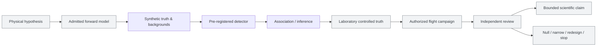
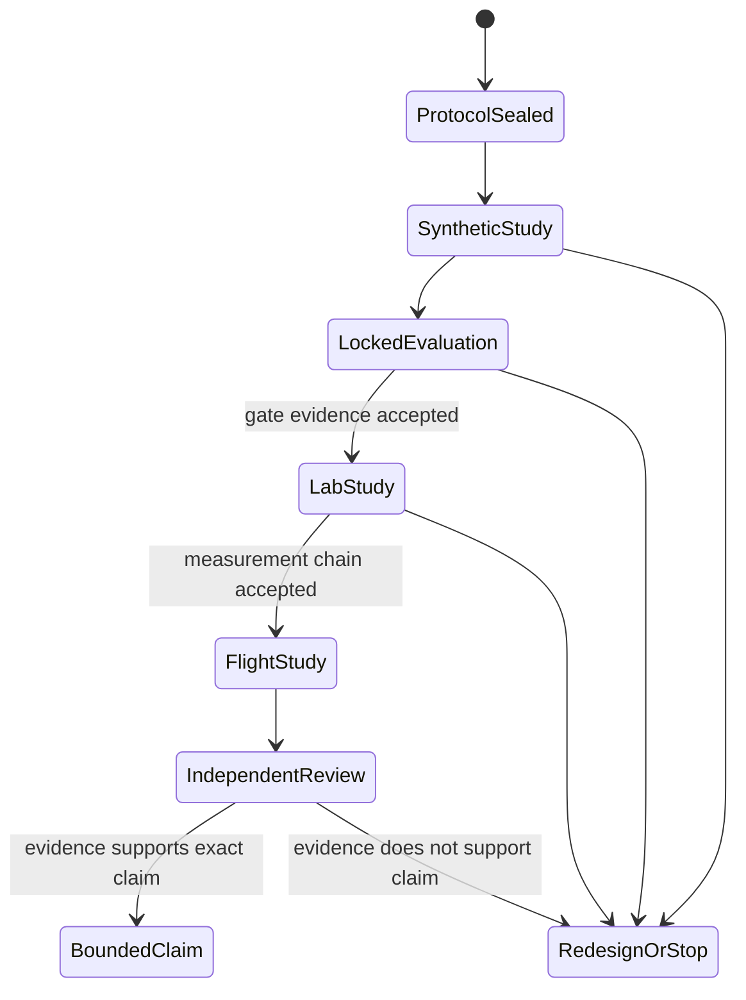
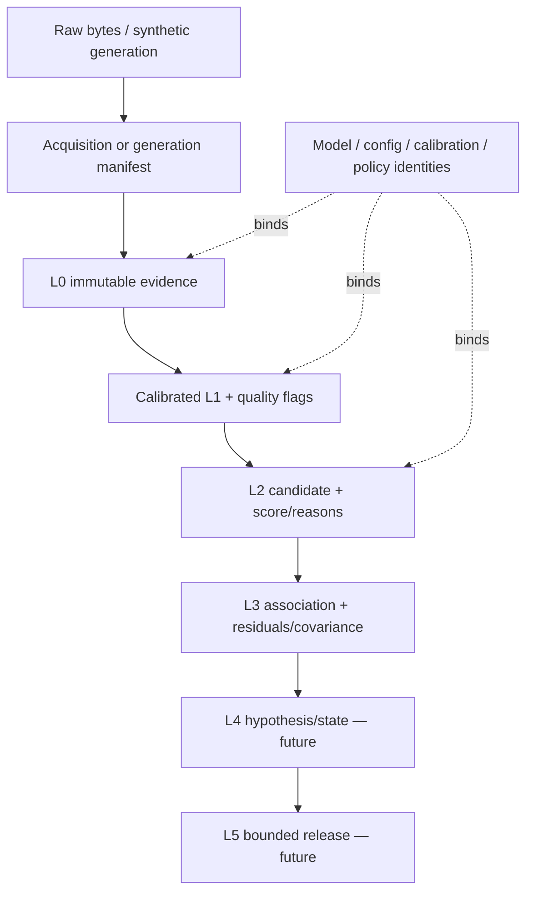

# HEIMDALL ELECTRA: An evidence-governed protocol for falsifiable passive ionospheric plasma-wake sensing research

**Manuscript type:** Registered-report / research-protocol draft  
**Version:** 0.1.0  
**Status:** Protocol and software-architecture paper; no physical-performance, laboratory, flight, observed-detection, or operational result is reported.  
**Citation status:** Not peer reviewed; do not cite as validation evidence.

## Abstract

Small orbital debris remains difficult to observe, particularly in regimes where conventional methods are incomplete or uncertain. Project HEIMDALL ELECTRA investigates a narrow, high-risk hypothesis: under specified plasma, trajectory, instrument, timing, and interference conditions, a charged hypervelocity object may produce a passive electromagnetic/electrostatic signature that is distinguishable from plausible background processes. This manuscript defines a falsifiable protocol for testing that hypothesis without conflating synthetic outputs, correlated signals, or software behavior with observed debris detection.

The protocol establishes: (1) explicit evidence classes; (2) preregistered hypotheses, primary metrics, and stopping rules; (3) immutable lineage from raw-like evidence through calibrated observations and candidates; (4) numerical-model admission, convergence, limiting-relation, and cross-implementation comparison controls; (5) locked-corpus separation; (6) blinded laboratory and flight validation requirements; (7) uncertainty-aware multi-node association; (8) independent-review and alternate-explanation procedures; and (9) strict boundaries prohibiting operational safety or maneuver use without separately governed evidence. The current repository implements synthetic research controls only. The protocol is designed so that a null result, ambiguity, or failure of assumptions is preserved as a scientifically informative result.

## 1. Research question and contribution

### 1.1 Primary research question

For a predeclared region of physical and instrumental parameter space, can a proposed plasma-wake signature be distinguished from plausible backgrounds with calibrated uncertainty and a bounded false-alarm rate?

### 1.2 Contribution

This work contributes a research architecture and protocol, rather than a claim that the proposed phenomenon has been measured. Its core contribution is the discipline needed to make a future positive or negative answer reviewable:

- a typed L0–L5 evidence model;
- reproducible scenario, model, calibration, detector, and policy identity;
- evidence-class barriers that prevent synthetic material from being relabeled observed;
- sealed numerical verification and locked evaluation controls;
- explicit alternative explanations and retraction paths; and
- a staged transition from theory to laboratory to authorized flight validation.

### 1.3 Non-claims

This protocol does not claim that plasma wakes from debris are physically present, detectable, localizable, operationally useful, or suitable for collision avoidance. It does not claim a performance figure, coverage figure, data source, launch path, spectrum authorization, hardware result, or scientific consensus. These exclusions are binding until independently reviewed evidence satisfies the relevant stage gate.

## 2. Conceptual model and evidence boundary

The present project occupies the synthetic control layer only. A software result is not a transition to laboratory, observed, or released evidence.

### 2.1 Evidence classes

| Class | Definition | Permitted use | Prohibited promotion |
| --- | --- | --- | --- |
| Synthetic | Versioned output from a declared scenario/model/seed | Software verification, development, sensitivity analysis | Observed detection or physical validation |
| Laboratory | Controlled measurement with preserved raw data and traceable calibration | Measurement-chain characterization and controlled validation | Flight performance or debris observation |
| Observed | Authorized source/instrument record with raw bytes, manifest, timing and provenance review | Carefully bounded scientific analysis | Object identity or operational action without independent validation |
| Released | Independently reviewed, policy-authorized, bounded product | Only the approved use case | Command or maneuver authority unless separately authorized |

## 3. Hypotheses, estimands, and falsifiers

### 3.1 Primary hypotheses

The project must preregister a parameter region before any model or campaign is evaluated. Let `R` define the target, plasma, geometry, instrument, timing, and background assumptions; let `D` be the frozen detection/association procedure; and let `B` be the set of plausible background and confounder processes.

- **H0 (non-distinguishability):** Within `R`, the output of `D` is not distinguishable from `B` at the preregistered false-alarm and uncertainty criteria.
- **H1 (bounded distinguishability):** Within `R`, the output of `D` meets all preregistered discrimination, calibration, uncertainty-coverage, and false-alarm criteria against `B`.

H1 is intentionally narrow. Acceptance in one region is not a global detection, localization, coverage, or operational claim.

### 3.2 Primary estimands

For each declared stratum—at minimum plasma regime, geometry/baseline, target proxy, sensor health, clock quality, duty cycle, and background type—report:

1. detection probability and confidence interval;
2. false alarms per declared observing-time denominator and interval;
3. precision/recall only when class definitions and prevalence are valid;
4. calibration of detector score to observed frequency;
5. completeness/data-loss fraction and reason;
6. latency, memory, energy, and retention behavior for edge experiments;
7. association false-coincidence rate and uncertainty coverage for multi-node work;
8. model-to-measurement discrepancy with uncertainty for laboratory/flight work.

Aggregate figures may summarize results, but never replace stratified reporting.

### 3.3 Predeclared falsifiers and stop rules

A stage must narrow, redesign, repeat under a new plan, or stop when any applicable condition occurs:

- a physical model fails its admitted validity, convergence, benchmark, relation, or independent-comparison evidence;
- a locked corpus does not meet the preregistered sensitivity and false-alarm thresholds in the required strata;
- score calibration or stated uncertainty coverage is materially inconsistent with held-out truth;
- a plausible alternative explanation accounts for the candidate population at least as well as the target hypothesis;
- time, calibration, source provenance, or raw evidence is incomplete;
- model-to-hardware discrepancy exceeds the accepted bound and remains unexplained;
- an independent review identifies a fatal methodological, safety, or interpretive flaw.

Threshold values are not invented in this protocol. They must be justified from the relevant model, measurement objective, safety boundary, and power analysis, then sealed before the evidence is inspected.

## 4. Study design and progression

### 4.1 Stage A — physics and synthetic truth

Before a candidate model is called physics-capable, it must have a named owner; governing equations; initial/boundary conditions; coordinate, time, and unit conventions; numerical method; validity range; limitations; verification cases; and independent review. The repository provides model-admission, conformance, benchmark, convergence, metamorphic-relation, and cross-implementation comparison contracts. These are necessary software/process controls, not physics validation.

Synthetic waveform generation must include nonidealities relevant to the declared instrument concept: transfer response, quantization, saturation, gaps, clock error, packet loss, self-noise, and backgrounds. The generated outcome label may be used only for the synthetic evaluator; it must not be embedded in L0, L1, or L2 records.

### 4.2 Stage B — independent locked evaluation

Detector developers and locked-corpus custodians must be organizationally or procedurally separated. Development data may inform design. A frozen detector/model/policy is evaluated once against a sealed corpus whose labels and complete material were not available for tuning. Viewing locked results consumes that corpus for selection purposes. Any adjustment requires a new corpus and plan.

### 4.3 Stage C — laboratory and hardware-in-the-loop validation

Laboratory experiments require calibrated test articles, traceable time and signal references, controlled injections, raw output preservation, test-readiness review, and acceptance procedures. Characterize amplitude, phase, cross-axis coupling, dynamic range, self-noise, timing, latency, power, and failure behavior. Replay untouched raw records through the intended edge and ground pipelines. Record and explain discrepancies; do not tune them away silently.

### 4.4 Stage D — authorized flight and independent validation

Flight campaigns require applicable institutional, launch, spectrum, safety, and operational authority; in-orbit calibration; preserved raw L0; documented time/health/completeness; predeclared exclusions; independent reference agreements where lawful; and an independent red team. The red team must actively test alternatives such as lightning, aurora, known transmitters, platform self-noise, artifacts, timing error, and geometry error. Discovery and confirmation should be separated where feasible.

## 5. Data governance and provenance

Every evidence item must carry a stable identifier, schema version, evidence class, source/artifact lineage, acquisition or generation time, time scale, units/frame, calibration/configuration/model/build identity, quality flags, uncertainty representation, and parent references.

For future observed material, the system requires both a preserved raw-artifact digest and acquisition-manifest digest. A checksum alone is never source authentication. Source admission also requires written terms, purpose, classification, retention, redistribution, correction/retraction handling, time-quality information, and source-specific verification. Context information is never silently promoted to target ground truth.

The current local ledger and audit bundle provide tamper-evident/reproducible review within their stated local-storage boundary. They are not claims of external signing, immutable retention, legal chain of custody, or independent audit.

## 6. Analysis plan

### 6.1 Frozen-analysis rule

Before locked, laboratory, or flight evaluation, seal the hypothesis; inclusion/exclusion criteria; data split; detector/association version; calibration/model/configuration identities; thresholds; metrics; strata; uncertainty method; alternate explanations; and decision rules. Any material change starts a new versioned plan and does not overwrite a prior result.

### 6.2 Quality control and missingness

The protocol reports missing data, gaps, rejected frames, unsigned material, replay attempts, time-quality failures, calibration applicability, saturation, and interference masks. Quality control must never destructively erase L0. Exclusion rates and reasons are reported by stratum, including whether an exclusion can bias the primary estimand.

### 6.3 Detector and association analysis

The initial detector is a transparent baseline, not a claim of optimality. Any learned ranking component requires source/scenario/seed-separated development, validation, and holdout data, plus calibration and explanation evidence. Candidate association must be gated by evidence class, time scale, timing uncertainty, node identity, and false-coincidence policy. Association is not object identity. Inference must retain ambiguity and covariance; it can be rejected, retracted, or archived through an explicit lifecycle.

### 6.4 Uncertainty and statistical reporting

Report units and denominators, not only percentages. Use confidence/credible intervals appropriate to the preregistered method; assess empirical coverage for stated uncertainties; report all model assumptions, parameter priors if applicable, dependence structures, multiple-comparison controls, sensitivity analyses, and negative controls. Do not substitute overall accuracy for false-alarm, calibration, completeness, or uncertainty evidence.

## 7. Bias, confounders, and independent challenge

The minimum alternate-explanation register includes natural electromagnetic activity, known transmitters, platform self-noise, sensor coupling, digital artifacts, timing faults, geometry/ephemeris errors, data selection bias, and model misspecification. Each experiment must state which alternatives were tested, which could not be tested, and how unresolved alternatives limit interpretation.

Independent challenge is mandatory at each material gate. Reviewers receive the protocol, sealed plan, raw-evidence locations, manifests, code/build identities, analysis outputs, exclusions, uncertainty report, and dissent record. Reviewers may reproduce, challenge, request counterfactuals, or recommend advance/narrow/redesign/stop. A favorable reviewer conclusion does not replace external replication.

## 8. Security, safety, and responsible use

HEIMDALL ELECTRA separates scientific evidence from operational control. The analyst console is read-only; it has no secret, command, privileged calculation, approval, release, or evidence-mutation path. Future hardware/ground systems must use least privilege, authenticated encryption, signed artifacts/configuration/commands, replay protection, schema/range/time validation, key rotation, fault containment, audit events, and recovery tests.

No output is authorized for collision avoidance, maneuvering, or safety decisions under this protocol. Any future operational use would require a separate safety case, authoritative governance, validated product definition, and approval process outside this research foundation.

## 9. Reproducibility package

The repository must accompany any protocol publication with:

1. versioned source code, dependency lock files, and build instructions;
2. claims, model-card, source-registry, and gate configuration snapshots;
3. synthetic scenario registry and seeds where permitted;
4. pre-registered plans and threshold policies;
5. model input/output artifacts, benchmark/convergence/relation/comparison records;
6. evaluation reports with complete strata, failures, exclusions, and limitations;
7. ledger/audit-bundle verification instructions; and
8. a statement of what material cannot be released, why, who can request access, and how independent review can occur.

For laboratory and flight work, release raw material and calibration evidence to the maximum lawful and safe extent. If restrictions prevent public release, preserve an independently accessible review route; a result that cannot be independently inspected must be described with correspondingly weaker confidence.

## 10. Current implementation and results disclosure

The current repository supports only this claim: it implements tested **synthetic research controls** for provenance, gating, uncertainty accounting, custody declarations, and local audit bundles. This is a software-control claim only. It does not validate plasma-wake physics or demonstrate on-orbit detection.

The physical-wake-performance claim is unsupported. The observed-debris-detection and operational-safety-use claims are prohibited. The machine-readable source of truth is [the claim registry](../config/research/claims.json), with explanatory governance in [claim governance](CLAIM_GOVERNANCE.md).

## 11. Discussion

The most scientifically valuable feature of this protocol is not its ambition; it is the ability to fail honestly. A high-risk hypothesis should be capable of earning support, losing support, or being narrowed without losing the evidence that produced the decision. By binding claim, data, model, calibration, detector, uncertainty, reviewer, and limitation together, HEIMDALL ELECTRA makes a future result easier to challenge and harder to overstate.

The protocol does not remove the need for deep plasma physics, meticulous instrumentation, authorized operations, or independent replication. It makes those investments more valuable by ensuring that their outputs remain interpretable and reviewable.

## 12. Required artifacts before submission as a results paper

This document may be submitted only as a protocol/architecture manuscript after institutional author, affiliation, conflict, and target-journal requirements are completed. A results paper requires, at minimum:

- admitted and independently reviewed physical model evidence;
- an independently held locked corpus and preregistered evaluation;
- appropriate laboratory measurement-chain validation;
- documented uncertainty coverage and alternative-explanation analysis;
- preserved evidence and a reproducibility/access package; and
- independent scientific review of the exact claim.

For an observed-detection paper, add authorized observed evidence, source/time/calibration provenance, blind analysis, independent references where possible, red-team analysis, and a clear statement that the result does not confer operational authority.

## 13. Author checklist

- [ ] Name authors, affiliations, funding, roles, and conflicts.
- [ ] Register the protocol and archive its version/digest before evaluation.
- [ ] Identify target journal and satisfy its registered-report/data/code policy.
- [ ] Replace placeholders only with independently reviewable evidence.
- [ ] Include negative findings, exclusions, failures, and dissent.
- [ ] Verify every capability statement against the claim registry.
- [ ] Obtain required institutional, safety, legal, export, spectrum, data-use, and launch approvals before applicable work.
- [ ] Obtain independent statistical and domain review before any results submission.

## Related project records

- [Implementation plan](HEIMDALL_IMPLEMENTATION_PLAN.md)
- [Stage delivery ledger](STAGE_DELIVERY_LEDGER.md)
- [Real-world gate-acquisition playbook](REAL_WORLD_GATE_ACQUISITION_PLAYBOOK.md)
- [Synthetic experiment protocol](EXPERIMENT_PROTOCOL.md)
- [Physics-model admission](PHYSICS_MODEL_ADMISSION.md)
- [Claim governance](CLAIM_GOVERNANCE.md)
- [Audit bundle contract](AUDIT_BUNDLES.md)
